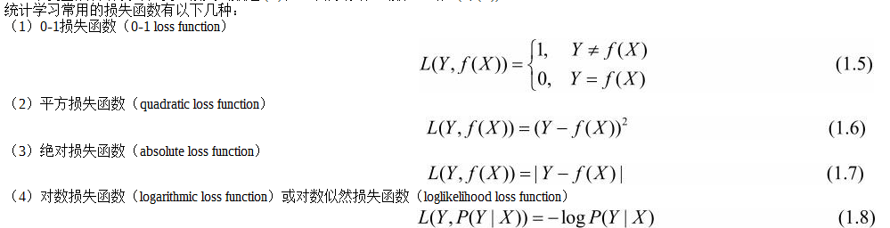
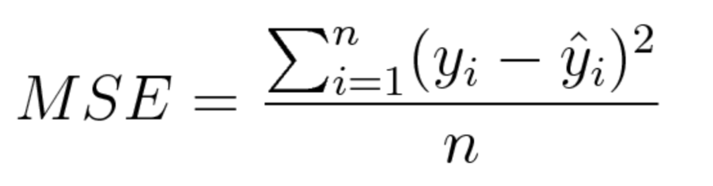
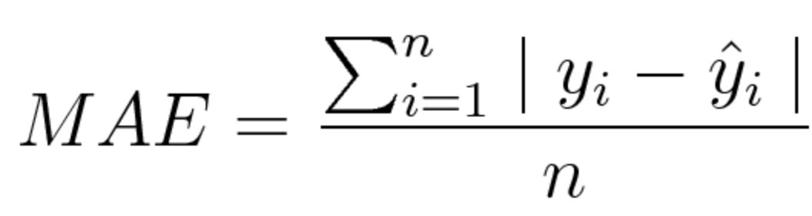
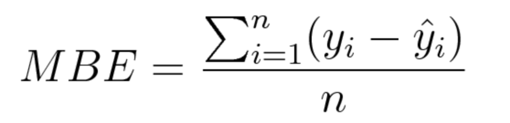
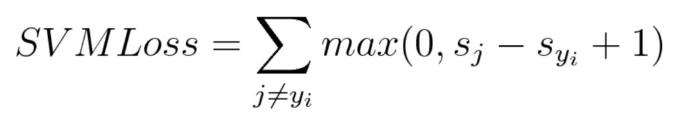
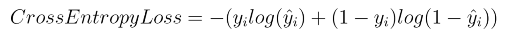

# 机器学习概论

## 1. 机器学习

### 概念

统计学习（statistical learning）是关于计算机基于数据构建概率统计模型并运用模型对数据进行预测与分析的一门学科。统计学习也称为统计机器学习（statistical machine learning）。

### 方法

统计学习由监督学习（supervised learning）、非监督学习（unsupervised learning）和强化学习（reinforcement learning）等组成。

### 流程


### 研究

统计学习方法的研究旨在开发新的学习方法；统计学习理论的研究在于探求统计学习方法的有效性与效率，以及统计学习的基本理论问题；统计学习应用的研究主要考虑将统计学习方法应用到实际问题中去，解决实际问题。

## 2. 监督学习

### 概念

监督学习利用训练数据集学习一个模型，再用模型对测试样本集进行预测（prediction）。由于在这个过程中需要训练数据集，而训练数据集往往是人工给出的，所以称为监督学习。

### 输入空间、特征空间与输出空间

在监督学习中，将输入与输出所有可能取值的集合分别称为输入空间（input space）与输出空间（output space）。输入与输出空间可以是有限元素的集合，也可以是整个欧氏空间。输入空间与输出空间可以是同一个空间，也可以是不同的空间；但通常输出空间远远小于输入空间

每个具体的输入是一个实例（instance），通常由特征向量（feature vector）表示。这时，所有特征向量存在的空间称为特征空间（feature space）。特征空间的每一维对应于一个特征。

### 联合概率分布

监督学习假设输入与输出的随机变量X和Y遵循联合概率分布P(X,Y)。P(X,Y)表示分布函数，或分布密度函数。注意，在学习过程中，假定这一联合概率分布存在，但对学习系统来说，联合概率分布的具体定义是未知的。训练数据与测试数据被看作是依联合概率分布P(X,Y)独立同分布产生的。统计学习假设数据存在一定的统计规律，X和Y具有联合概率分布的假设就是监督学习关于数据的基本假设。

### 假设空间

监督学习的目的在于学习一个由输入到输出的映射，这一映射由模型来表示。换句话说，学习的目的就在于找到最好的这样的模型。模型属于由输入空间到输出空间的映射的集合，这个集合就是假设空间（hypothesis space）。假设空间的确定意味着学习范围的确定。

## 3. 机器学习三要素

统计学习方法都是由模型、策略和算法构成的，即统计学习方法由三要素构成，可以简单地表示为
                        方法＝模型＋策略＋算法

### 模型

模型的假设空间（hypothesis space）包含所有可能的条件概率分布或决策函数。例如，假设决策函数是输入变量的线性函数，那么模型的假设空间就是所有这些线性函数构成的函数集合。

### 策略

有了模型的假设空间，统计学习接着需要考虑的是按照什么样的准则学习或选择最优的模型。统计学习的目标在于从假设空间中选取最优模型。
首先引入损失函数与风险函数的概念。损失函数度量模型一次预测的好坏，风险函数度量平均意义下模型预测的好坏。

#### 1. 损失函数和风险函数

对于给定的输入X，由f(X)给出相应的输出Y，这个输出的预测值f(X)与真实值Y可能一致也可能不一致，用一个损失函数（loss function）或代价函数（cost function）来度量预测错误的程度。损失函数是f(X)和Y的非负实值函数，记作L(Y,f(X))。
统计学习常用的损失函数有以下几种


损失函数值越小，模型就越好。由于模型的输入、输出（X,Y）是随机变量，遵循联合分布P(X,Y)。所以损失函数的期望是理论上模型f(X)关于联合分布P(X,Y)的平均意义下的损失，称为风险函数（risk function）或期望损失（expected loss）。

给定一个训练数据集，模型f(X)关于训练数据集的平均损失称为经验风险（empirical risk）或经验损失（empirical loss），记作Remp。

期望风险Rexp(f)是模型关于联合分布的期望损失，经验风险Remp(f)是模型关于训练样本集的平均损失。根据大数定律，当样本容量N趋于无穷时，经验风险Remp(f)趋于期望风险Rexp(f)。所以一个很自然的想法是用经验风险估计期望风险。但是，由于现实中训练样本数目有限，甚至很小，所以用经验风险估计期望风险常常并不理想，要对经验风险进行一定的矫正。这就关系到监督学习的两个基本策略：经验风险最小化和结构风险最小化。

#### 2. 经验风险最小化与结构风险最小化

在假设空间、损失函数以及训练数据集确定的情况下，经验风险函数式（1.10）就可以确定。经验风险最小化（empirical risk minimization，ERM）的策略认为，经验风险最小的模型是最优的模型。

当样本容量足够大时，经验风险最小化能保证有很好的学习效果，在现实中被广泛采用。但是，当样本容量很小时，经验风险最小化学习的效果就未必很好，会产生后面将要叙述的“过拟合(over-fitting)”现象。

结构风险最小化（structural risk minimization，SRM）是为了防止过拟合而提出来的策略。结构风险最小化等价于正则化（regularization）。结构风险在经验风险上加上表示模型复杂度的正则化项（regularizer）或罚项（penalty term）。
其中J(f)为模型的复杂度，是定义在假设空间上的泛函。模型f越复杂，复杂度J(f)就越大；反之，模型f越简单，复杂度J(f)就越小。也就是说，复杂度表示了对复杂模型的惩罚。≥0是系数，用以权衡经验风险和模型复杂度。结构风险小需要经验风险与模型复杂度同时小。结构风险小的模型往往对训练数据以及未知的测试数据都有较好的预测。结构风险最小化的策略认为结构风险最小的模型是最优的模型。

### 算法

算法是指学习模型的具体计算方法。统计学习基于训练数据集，根据学习策略，从假设空间中选择最优模型，最后需要考虑用什么样的计算方法求解最优模型。

这时，统计学习问题归结为最优化问题，统计学习的算法成为求解最优化问题的算法。如果最优化问题有显式的解析解，这个最优化问题就比较简单。但通常解析解不存在，这就需要用数值计算的方法求解。如何保证找到全局最优解，并使求解的过程非常高效，就成为一个重要问题。统计学习可以利用已有的最优化算法，有时也需要开发独自的最优化算法。

统计学习方法之间的不同，主要来自其模型、策略、算法的不同。确定了模型、策略、算法，统计学习的方法也就确定了。这也就是将其称为统计学习三要素的原因。

## 4. 模型评估与模型选择

### 训练误差与测试误差

训练误差的大小，对判断给定的问题是不是一个容易学习的问题是有意义的，但本质上不重要。测试误差反映了学习方法对未知的测试数据集的预测能力，是学习中的重要概念。显然，给定两种学习方法，测试误差小的方法具有更好的预测能力，是更有效的方法。通常将学习方法对未知数据的预测能力称为泛化能力（generalization ability）.

### 过拟合

如果一味追求提高对训练数据的预测能力，所选模型的复杂度则往往会比真模型更高。这种现象称为过拟合（over-fitting）。过拟合是指学习时选择的模型所包含的参数过多，以致于出现这一模型对已知数据预测得很好，但对未知数据预测得很差的现象。可以说模型选择旨在避免过拟合并提高模型的预测能力。

### 模型选择

#### 1. 正则化

模型选择的典型方法是正则化（regularization）。正则化是结构风险最小化策略的实现，是在经验风险上加一个正则化项（regularizer）或罚项(penalty term)。正则化项一般是模型复杂度的单调递增函数，模型越复杂，正则化值就越大。比如，正则化项可以是模型参数向量的范数。

#### 2. 交叉验证

如果给定的样本数据充足，进行模型选择的一种简单方法是随机地将数据集切分成三部分，分别为训练集（training set）、验证集（validation set）和测试集（test set）。训练集用来训练模型，验证集用于模型的选择，而测试集用于最终对学习方法的评估。
在学习到的不同复杂度的模型中，选择对验证集有最小预测误差的模型。由于验证集有足够多的数据，用它对模型进行选择也是有效的。

但是，在许多实际应用中数据是不充足的。为了选择好的模型，可以采用交叉验证方法。交叉验证的基本想法是重复地使用数据；把给定的数据进行切分，将切分的数据集组合为训练集与测试集，在此基础上反复地进行训练、测试以及模型选择。

##### 1．简单交叉验证

简单交叉验证方法是：首先随机地将已给数据分为两部分，一部分作为训练集，另一部分作为测试集（例如，70%的数据为训练集，30%的数据为测试集）；然后用训练集在各种条件下（例如，不同的参数个数）训练模型，从而得到不同的模型；在测试集上评价各个模型的测试误差，选出测试误差最小的模型。

##### 2．S折交叉验证

应用最多的是S折交叉验证（S-fold cross validation），方法如下：首先随机地将已给数据切分为S个互不相交的大小相同的子集；然后利用S-1个子集的数据训练模型，利用余下的子集测试模型；将这一过程对可能的S种选择重复进行；最后选出S次评测中平均测试误差最小的模型。

##### 3．留一交叉验证

S折交叉验证的特殊情形是S＝N，称为留一交叉验证（leave-one-out cross validation），往往在数据缺乏的情况下使用。这里，N是给定数据集的容量。

### Bias-Variance Tradeoff

[准确是两个概念。准是 bias 小，确是 variance 小。准确是相对概念，因为 bias-variance tradeoff。](https://liam0205.me/2017/03/25/bias-variance-tradeoff/)

## 5. 生成模型与判别模型

监督学习方法又可以分为生成方法（generative approach）和判别方法（discriminative approach）。所学到的模型分别称为生成模型（generative model）和判别模型（discriminative model）。

生成方法由数据学习联合概率分布P(X,Y)，然后求出条件概率分布P(Y|X)作为预测的模型，即生成模型：P(Y|X) = P(X,Y)/P(X).这样的方法之所以称为生成方法，是因为模型表示了给定输入X产生输出Y的生成关系。典型的生成模型有：朴素贝叶斯法和隐马尔可夫模型.

判别方法由数据直接学习决策函数f(X)或者条件概率分布P(Y|X)作为预测的模型，即判别模型。判别方法关心的是对给定的输入X，应该预测什么样的输出Y。典型的判别模型包括：k近邻法、感知机、决策树、逻辑斯谛回归模型、最大熵模型、支持向量机、提升方法和条件随机场等。

生成方法的特点：生成方法可以还原出联合概率分布P(X,Y)，而判别方法则不能；生成方法的学习收敛速度更快，即当样本容量增加的时候，学到的模型可以更快地收敛于真实模型；当存在隐变量时，仍可以用生成方法学习，此时判别方法就不能用。

判别方法的特点：判别方法直接学习的是条件概率P(Y|X)或决策函数f(X)，直接面对预测，往往学习的准确率更高；由于直接学习P(Y|X)或f(X)，可以对数据进行各种程度上的抽象、定义特征并使用特征，因此可以简化学习问题。

## 6. 分类问题

评价分类器性能的指标一般是分类准确率（accuracy），其定义是：对于给定的测试数据集，分类器正确分类的样本数与总样本数之比。也就是损失函数是0-1损失时测试数据集上的准确率（见公式（1.17））。

对于二类分类问题常用的评价指标是精确率（precision）与召回率（recall）。通常以关注的类为正类，其他类为负类，分类器在测试数据集上的预测或正确或不正确，4种情况出现的总数分别记作：
TP——将正类预测为正类数；
FN——将正类预测为负类数；
FP——将负类预测为正类数；
TN——将负类预测为负类数。

精确率定义为      P = TP / (TP + FP)

召回率定义为      R = TP / (TP + FN)

此外，还有F1值，是精确率和召回率的调和均值，即   2 / F1 = 1 / P + 1 / R

## 7. 回归问题

回归模型正是表示从输入变量到输出变量之间映射的函数。回归问题的学习等价于函数拟合：选择一条函数曲线使其很好地拟合已知数据且很好地预测未知数据。

回归学习最常用的损失函数是平方损失函数，在此情况下，回归问题可以由著名的最小二乘法（least squares）求解。

## 8. 损失函数

机器通过损失函数进行学习。这是一种评估特定算法对给定数据建模程度的方法。如果预测值与实际结果偏离较远，损失函数会得到一个非常大的值。在一些优化函数的辅助下，损失函数逐渐学会减少预测值的误差。本文将介绍几种损失函数及其在机器学习和深度学习领域的应用。

没有一个适合所有机器学习算法的损失函数。针对特定问题选择损失函数涉及到许多因素，比如所选机器学习算法的类型、是否易于计算导数以及数据集中异常值所占比例。

从学习任务的类型出发，可以从广义上将损失函数分为两大类——回归损失和分类损失。在分类任务中，我们要从类别值有限的数据集中预测输出，比如给定一个手写数字图像的大数据集，将其分为 0～9 中的一个。而回归问题处理的则是连续值的预测问题，例如给定房屋面积、房间数量以及房间大小，预测房屋价格。

```
NOTE
        n        - Number of training examples.
        i        - ith training example in a data set.
        y(i)     - Ground truth label for ith training example.
        y_hat(i) - Prediction for ith training example.
```

## 8.1 回归损失函数

### 8.1.1 均方误差/平方损失/L2 损失



顾名思义，均方误差（MSE）度量的是预测值和实际观测值间差的平方的均值。它只考虑误差的平均大小，不考虑其方向。
但由于经过平方，与真实值偏离较多的预测值会比偏离较少的预测值受到更为严重的惩罚。再加上 MSE 的数学特性很好，这使得计算梯度变得更容易。

```python
import numpy as np
y_hat = np.array([0.000, 0.166, 0.333])
y_true = np.array([0.000, 0.254, 0.998])
def rmse(predictions, targets):
    differences = predictions - targets
    differences_squared = differences ** 2
    mean_of_differences_squared = differences_squared.mean()
    rmse_val = np.sqrt(mean_of_differences_squared)
    return rmse_val
print("d is: " + str(["%.8f" % elem for elem in y_hat]))
print("p is: " + str(["%.8f" % elem for elem in y_true]))
rmse_val = rmse(y_hat, y_true)
print("rms error is: " + str(rmse_val))
```

### 8.1.2 平均绝对误差/L1 损失



平均绝对误差（MAE）度量的是预测值和实际观测值之间绝对差之和的平均值。和 MSE 一样，这种度量方法也是在不考虑方向的情况下衡量误差大小。
但和 MSE 的不同之处在于，MAE 需要像线性规划这样更复杂的工具来计算梯度。此外，MAE 对异常值更加稳健，因为它不使用平方。

```python
import numpy as np
y_hat = np.array([0.000, 0.166, 0.333])
y_true = np.array([0.000, 0.254, 0.998])

print("d is: " + str(["%.8f" % elem for elem in y_hat]))
print("p is: " + str(["%.8f" % elem for elem in y_true]))

def mae(predictions, targets):
    differences = predictions - targets
    absolute_differences = np.absolute(differences)
    mean_absolute_differences = absolute_differences.mean()
    return mean_absolute_differences
mae_val = mae(y_hat, y_true)
print ("mae error is: " + str(mae_val))
```

### 8.1.3 平均偏差误差（mean bias error）



与其它损失函数相比，这个函数在机器学习领域没有那么常见。
它与 MAE 相似，唯一的区别是这个函数没有用绝对值。用这个函数需要注意的一点是，正负误差可以互相抵消。
尽管在实际应用中没那么准确，但它可以确定模型存在正偏差还是负偏差。

## 8.2 分类损失函数

### 8.2.1 Hinge Loss/多分类 SVM 损失



简言之，在一定的安全间隔内（通常是 1），正确类别的分数应高于所有错误类别的分数之和。
因此 hinge loss 常用于最大间隔分类（maximum-margin classification），最常用的是支持向量机。
尽管不可微，但它是一个凸函数，因此可以轻而易举地使用机器学习领域中常用的凸优化器。

### 8.2.2 交叉熵损失/负对数似然



这是分类问题中最常见的设置。随着预测概率偏离实际标签，交叉熵损失会逐渐增加。
注意，当实际标签为 1(y(i)=1) 时，函数的后半部分消失，而当实际标签是为 0(y(i=0)) 时，函数的前半部分消失。
简言之，我们只是把对真实值类别的实际预测概率的对数相乘。还有重要的一点是，交叉熵损失会重重惩罚那些置信度高但是错误的预测值。

```python
import numpy as np
predictions = np.array([[0.25,0.25,0.25,0.25],
                        [0.01,0.01,0.01,0.96]])
targets = np.array([[0,0,0,1],
                   [0,0,0,1]])
def cross_entropy(predictions, targets, epsilon=1e-10):
    predictions = np.clip(predictions, epsilon, 1. - epsilon)
    N = predictions.shape[0]
    ce_loss = -np.sum(np.sum(targets * np.log(predictions + 1e-5)))/N
    return ce_loss
cross_entropy_loss = cross_entropy(predictions, targets)
print ("Cross entropy loss is: " + str(cross_entropy_loss))
```