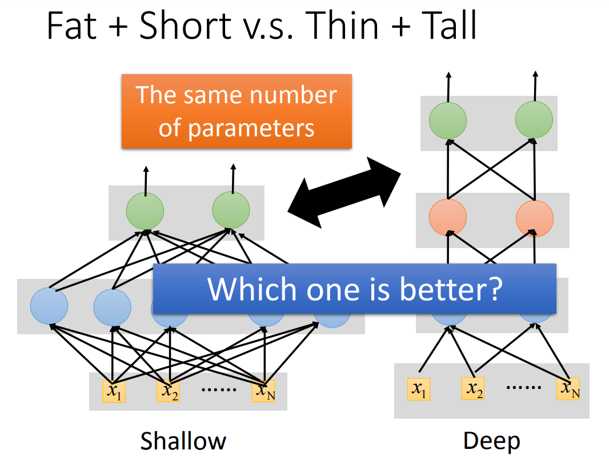

# 深度神经网络

## 神经网络架构

架构 （architecture）一词是指网络的整体结构：它应该具有多少单元，以及这些单元应该如何连接。

主要的架构考虑是选择**网络的深度和每一层的宽度**。
我们将会看到，即使只有一个隐藏层的网络也足够适应训练集。
更深层的网络通常能够对每一层使用更少的单元数和**更少的参数**，并且经常**容易泛化到测试集**，但是通常也更难以优化。
对于一个具体的任务，**理想的网络架构必须通过实验**，观测在验证集上的误差来找到。

### 万能近似定理
万能近似定理 （universal approximation theorem）（Hornik et al. ，1989；Cybenko，1989）表明，
一个前馈神经网络如果具有线性输出层和至少一层具有任何一种“挤压”性质的激活函数（例如logistic sigmoid激活函数）的隐藏层，
只要给予网络足够数量的隐藏单元，它可以以任意的精度来近似任何从一个有限维空间到另一个有限维空间的Borel可测函数。

万能近似定理意味着无论我们试图学习什么函数，我们知道一个大的MLP一定能够表示这个函数。然而，我们不能保证训练算法能够学得这个函数。
即使MLP能够表示该函数，学习也可能因两个不同的原因而失败：

首先，用于训练的优化算法可能找不到用于期望函数的参数值。  其次，训练算法可能由于过拟合而选择了错误的函数。

### 深度
具有单层的前馈网络足以表示任何函数，但是网络层可能大得不可实现，并且可能无法正确地学习和泛化。
在很多情况下，使用更深的模型能够减少表示期望函数所需的单元的数量，并且可以减少泛化误差。

**深度神经网络所需的单元的数量更少**：  存在一些函数族能够在网络的深度大于某个值d时被高效地近似，而当深度被限制到小于或等于d时需要一个远远大于之前的模型。

选择深度模型默许了一个非常普遍的信念，那就是我们想要学得的函数应该涉及几个**更加简单的函数的组合**。

我们可以将深度结构的使用解释为另一种信念，那就是我们想要学得的函数是包含多个步骤的计算机程序，其中每个步骤使用前一步骤的输出。

根据经验，更深的模型似乎确实在广泛的任务中泛化得更好。

