# 循环神经网络 （recurrent neural network）

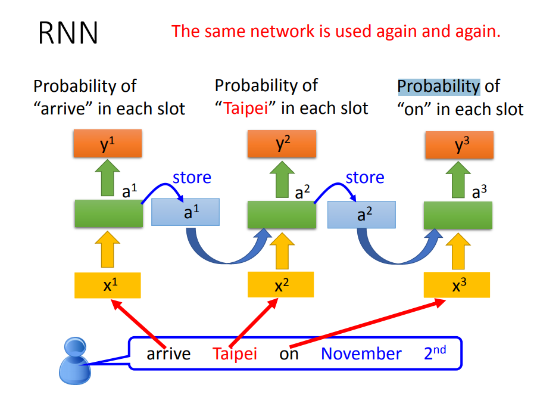
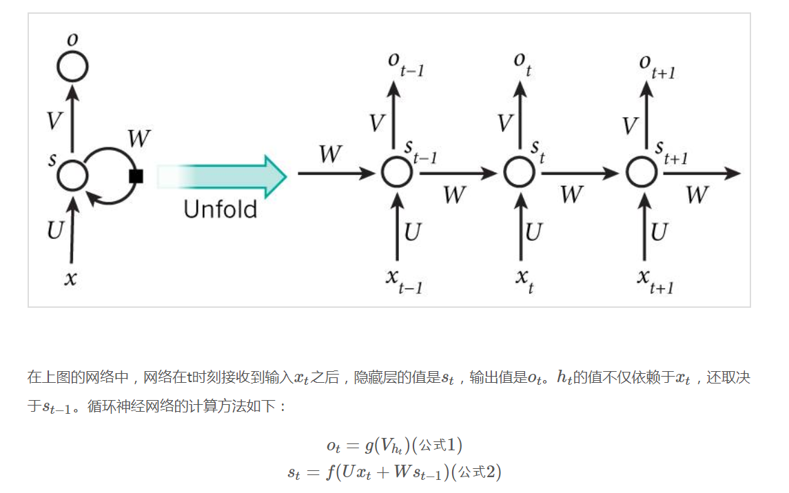
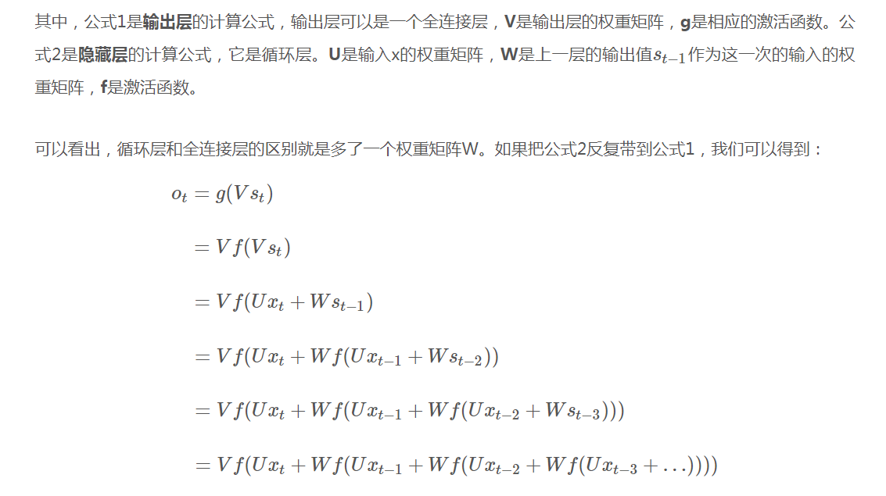
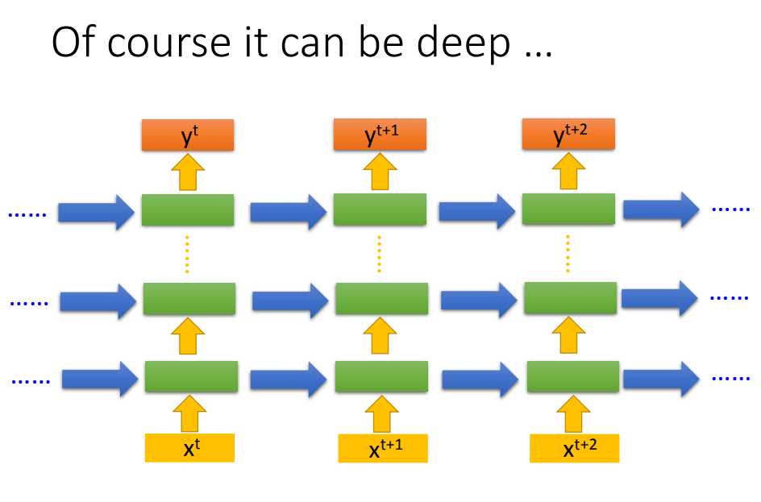
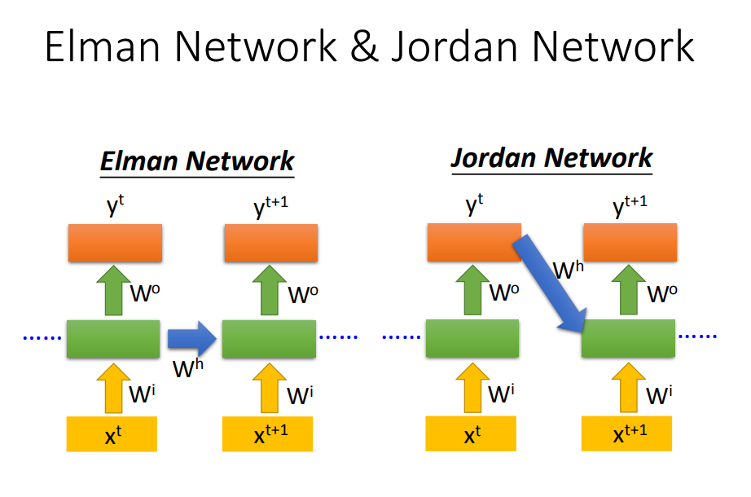
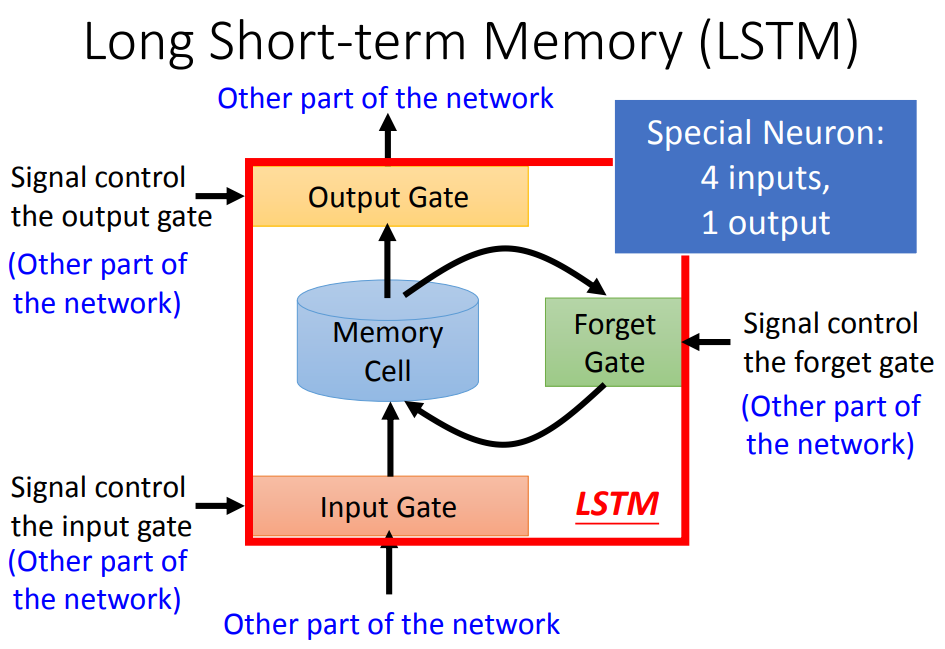
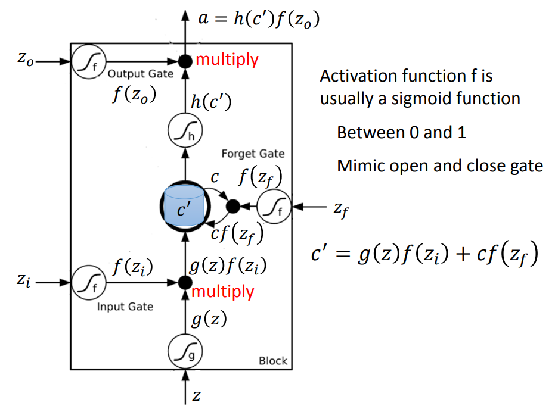

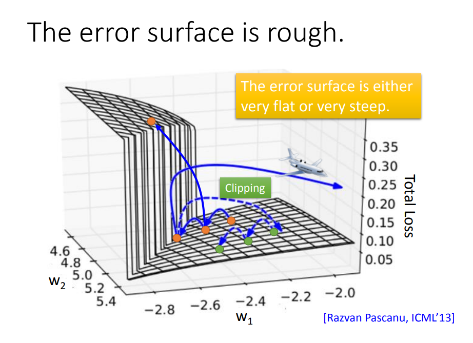
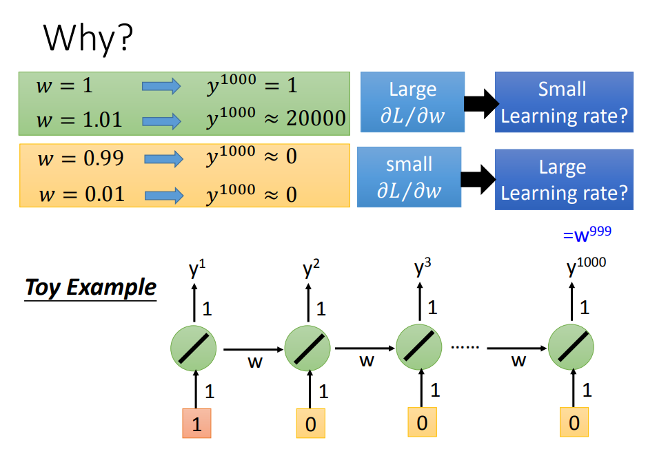
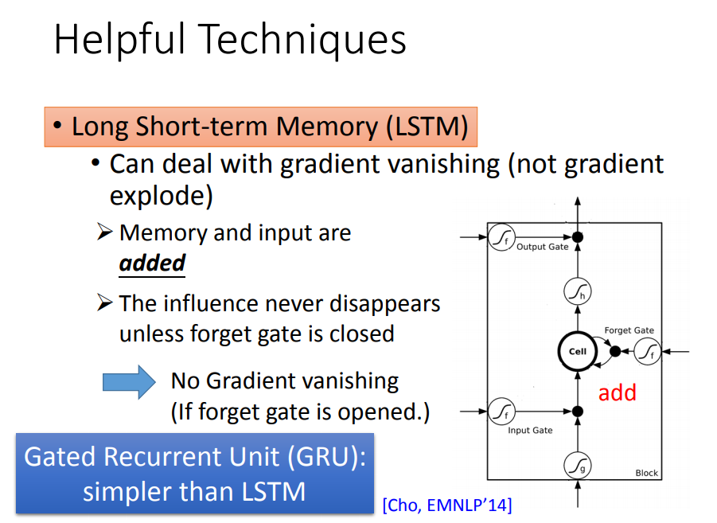

## 长期依赖问题
根本问题是，经过许多阶段传播后的梯度倾向于消失（大部分情况）或爆炸（很少，但对优化过程影响很大）。
RNN训练困难的主要原因在于隐藏层参数w的传播：
由于误差传播在展开后的RNN上，无论在前向传播过程还是在反向传播过程中w都会乘上多次，这就导致：
* 梯度消失：如果梯度很小的话（<1），乘上多次指数级下降，对输出几乎就没有影响了
* 梯度爆炸：反过来，如果梯度很大的话，乘上多次指数级增加，又导致了梯度爆炸

当然了，这个问题其实存在于任何深度神经网络中，只是由于RNN的递归结构导致其尤其明显。

对于梯度爆炸问题，可以通过截断的方式来有效避免：

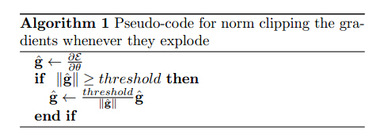

而对梯度消失问题，则有很多不同的方案：

1. 有效初始化+ReLU激活函数能够得到较好效果
2. 算法上的优化，例如截断的BPTT算法。
3. 模型上的改进，例如LSTM、GRU单元都可以有效解决长期依赖问题。
4. 在BPTT算法中加入skip connection，此时误差可以间歇的向前传播。