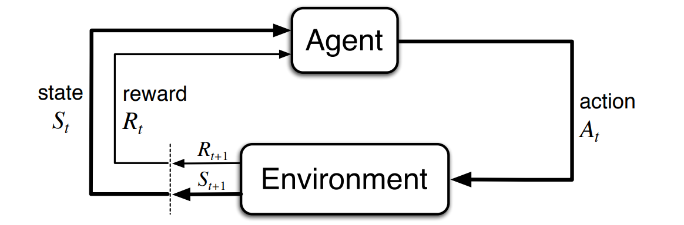
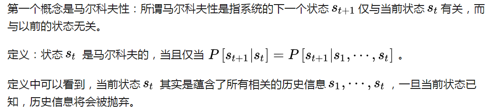
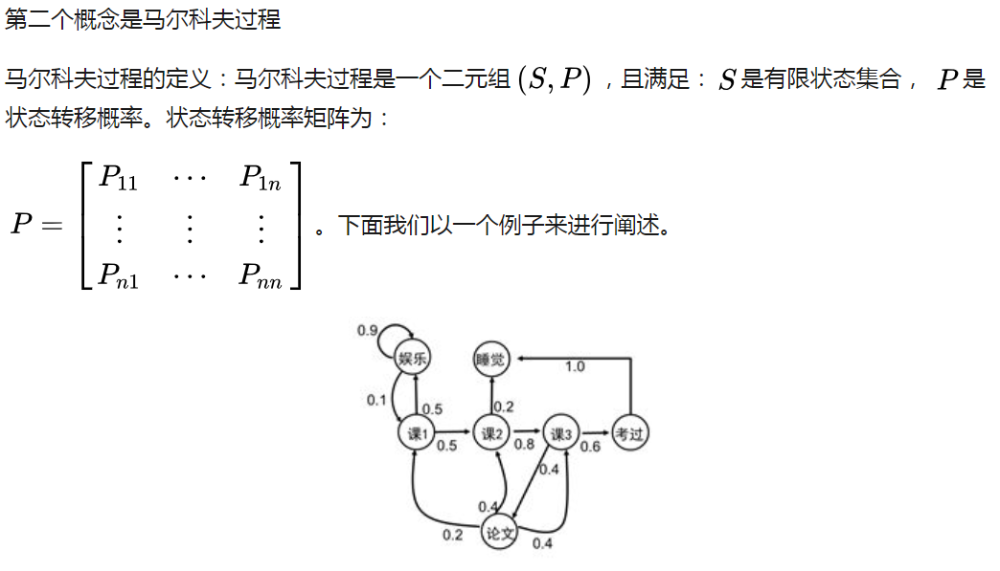
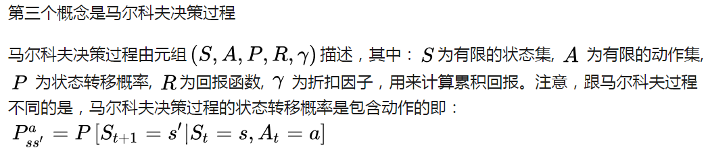
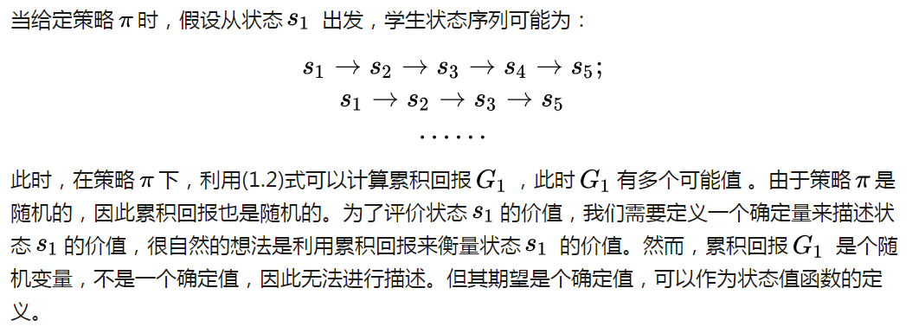
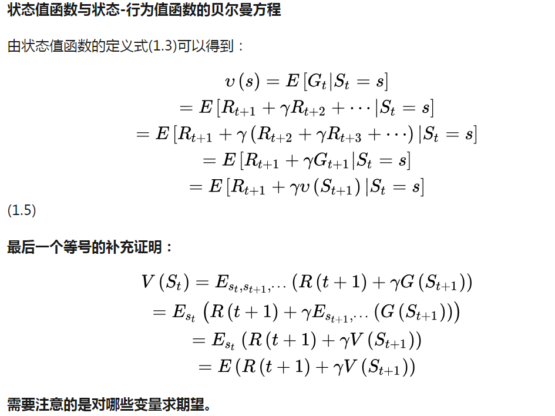
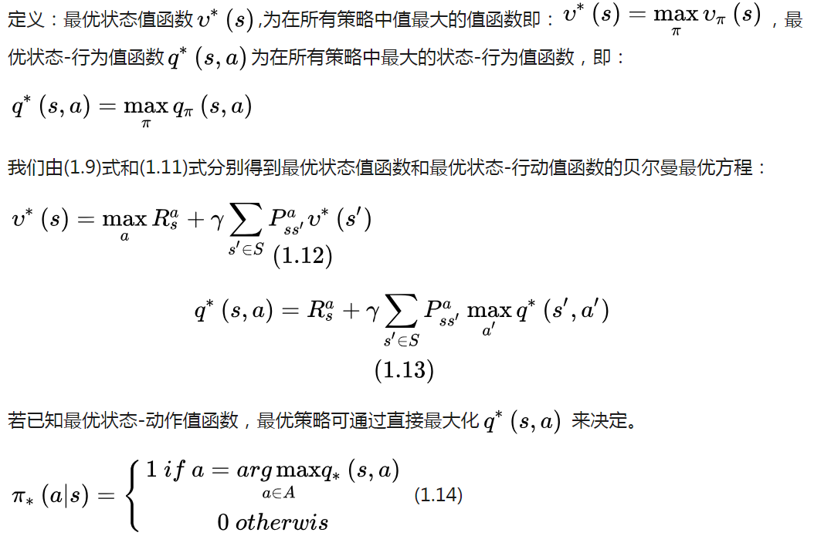

# 强化学习基础

智能体在完成某项任务时，首先通过动作A与周围环境进行交互，在动作A和环境的作用下，智能体会产生新的状态，同时环境会给出一个立即回报。
如此循环下去，智能体与环境进行不断地交互从而产生很多数据。强化学习算法利用产生的数据修改自身的动作策略，
再与环境交互，产生新的数据，并利用新的数据进一步改善自身的行为，经过数次迭代学习后，智能体能最终地学到完成相应任务的最优动作（最优策略）。

## 1. 马尔科夫决策过程

无数学者们通过几十年不断地努力和探索，提出了一套可以解决**大部分**强化学习问题的框架，这个框架就是马尔科夫决策过程，简称MDP。
下面我们会循序渐进地介绍马尔科夫决策过程：先介绍马尔科夫性，再介绍马尔科夫过程，最后介绍马尔科夫决策过程。

强化学习的目标是给定一个马尔科夫决策过程，寻找最优策略。
所谓策略是指状态到动作的映射，策略常用符号π表示，它是指给定状态s 时，动作集上的一个分布，即

当给定一个策略π时，我们就可以计算累积回报了。首先定义累积回报：

### 状态值函数
当智能体采用策略π时，累积回报服从一个分布，累积回报在状态s处的期望值定义为状态值函数：

相应地，状态行为值函数为：

### 贝尔曼方程

### 状态值函数和行为值函数的具体计算过程

将(1.8)式带入到(1.7)式可以得到：

将(1.10)带入到(1.8)中，得到行为状态-行为值函数：

计算状态值函数的目的是为了构建学习算法从数据中得到最优策略。每个策略对应着一个状态值函数，最优策略自然对应着最优状态值函数。

