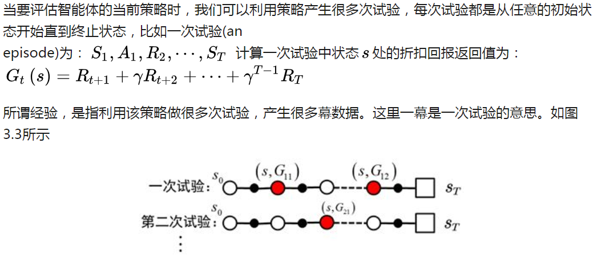

# 值函数法

解决无模型的马尔科夫决策问题是强化学习算法的精髓。

## 1. 蒙特卡罗方法

状态值函数和行为值函数的计算实际上是计算返回值的期望。
动态规划的方法是利用模型对该期望进行计算。在没有模型时，我们可以采用蒙特卡罗的方法计算该期望，即利用随机样本来估计期望。
在计算值函数时，蒙特卡罗方法是利用经验平均代替随机变量的期望。
此处，我们要理解两个词，何为经验？何为平均。

首先看何为经验：

再来看什么是平均：
这个概念很简单，平均就是求均值。不过，利用蒙特卡罗方法求状态s处的值函数时，又可以分为第一次访问蒙特卡罗方法和每次访问蒙特卡罗方法。

### 1.1 策略评估（递增计算均值）

即：

这种形式的更新由于不需要像传统做法那样将每个样本的值都存放在内存中，所以是一个很有效率的做法---被称为递增法（Incremental Implementation）。
### 1.2 策略改善
蒙特卡罗方法利用经验平均对策略值函数进行估计。当值函数被估计出来后，对于每个状态s ，通过最大化动作值函数，来进行策略的改进。

### 1.3 探索
由于不知道智能体与环境交互的模型，蒙特卡罗方法是利用经验平均来估计值函数。
能否得到正确的值函数，取决于经验。
**如何获得充足的经验是无模型强化学习的核心所在**。

在动态规划方法中，为了保证值函数的收敛性，算法会对状态空间中的状态进行逐个扫描。
无模型的方法充分评估策略值函数的前提是每个状态都能被访问到。
因此，在蒙特卡洛方法中必须采用一定的方法保证每个状态都能被访问到。

#### 1.3.1 探索性初始化
所谓探索性初始化是指每个状态都有一定的几率作为初始状态。
在探索性初始化中，迭代每一幕时，初始状态是随机分配的，这样可以保证迭代过程中每个状态行为对都能被选中。

探索性初始化蒙特卡罗方法：

#### 1.3.2 温和的探索策略
探索性初始化蕴含着一个假设，即：假设所有的动作都被无限频繁选中。对于这个假设，有时很难成立，或无法完全保证。

我们会问，如何保证初始状态不变的同时，又能保证报个状态行为对可以被访问到？答案是：精心地设计你的探索策略，以保证每个状态都能被访问到。

可是如何精心地设计探索策略？符合要求的探索策略是什么样的？

#### 1.3.3 同策略、异策略
根据行动策略和目标策略（策略改善公式右边策略）是否是同一个策略，蒙特卡罗方法又分为on-policy和off-policy.

##### 同策略
既然既要改进策略又需要保证探索，那么就设计一个策略（如 ε-soft策中的ε-greedy策略），
使得其有比较大的概率在任务中利用目前探索到的最优操作，而以比较小的概率随机选择一个其他操作来探索。
这样就保证了Exploration-Exploitation的平衡。
若行动策略和目标策略是同一个策略，我们称之为on-policy,可翻译为同策略。比如，行动策略和目标策略都是 ε-greedy策略。

##### 异策略
既然既需Exploration也需要Exploitation，那为什么不设计两个策略呢？一个专门负责实际探索，一个专门负责寻找最优策略。
若行动策略和目标策略是不同的策略，我们称之为off-policy,可翻译为异策略。例如用来评估和改进的策略π是贪婪策略，用于产生数据的探索性策略μ为探索性策略，如 ε-greedy策略。
用于异策略的目标策略π和行动策略μ并非任意选择的，而是必须满足一定的条件。
这个条件是覆盖性条件即：行动策略μ产生的行为覆盖或包含目标策略π产生的行为。

由于π本身并没有样本，需要从μ策略产生的样本回报来估算，所以需要通过两个策略的关系来推测---由此引入统计学中的重要性采样。

### 1.4 重要性采样

重要性采样来源于求期望。

当随机变量z的分布非常复杂时，无法利用解析的方法产生用于逼近期望的样本，这时，我们可以选用一个概率分布很简单，产生样本很容易的概率分布q(z) ，比如正态分布。
原来的期望可变为：

基于重要性采样的积分估计为无偏估计，即估计的期望值等于真实的期望。但是，基于重要性采样的积分估计的方差无穷大。
这是因为，原来的被积函数乘上了一个重要性权重，这就改变了被积函数的形状及分布。
尽管被积函数的均值没有发生变化，但方差明显发生改变。在重要性采样中，使用的采样概率分布与原概率分布越接近，方差越小。
然而，被积函数的概率分布往往很难求得，或很奇怪，没有简单地采样概率分布能与之相似，如果使用分布差别很大的采样概率对原概率分布进行采样，方差会趋近于无穷大。

一种减小重要性采样积分方差的方法是采用加权重要性采样：

普通重要性采样值函数估计为:

加权重要性采样值函数估计为:

由于分母不同，可见普通模式有高方差但低偏差（即样本足够真实但泛化性较差），而加权模式则相反。就实际情况而言，加权模式效果会比较好，而普通模式则极有可能因为高方差而无法收敛。

## 2. 时间差分法

时间差分(TD)方法是强化学习理论中最核心的内容，是强化学习领域最重要的成果。
与动态规划的方法和蒙特卡罗的方法比，时间差分的方法主要不同点在值函数估计上面。
相比于动态规划的方法，蒙特卡罗的方法需要等到每次试验结束，所以学习速度慢，学习效率不高。从两者的比较我们很自然地会想，
能不能借鉴动态规划中boot’strapping的方法，在不等到试验结束时就估计当前的值函数呢？

答案是肯定的，这就是时间差分方法的精髓。
时间差分方法结合了蒙特卡罗的采样方法（即做试验）和动态规划方法的bootstrapping(利用后继状态的值函数估计当前值函数)。

从统计学的角度来看，蒙特卡罗方法（MC方法）和时间差分方法（TD方法）都是利用样本去估计值函数的方法，哪种估计方法更好呢？
既然是统计方法，我们就可以从期望和方差两个指标对两种方法进行对比。

时间差分法包括同策略的Sarsa方法和异策略的Qlearning方法。

