# 策略梯度法

在值函数的方法中，我们迭代计算的是值函数，然后根据值函数对策略进行改进；
而在策略搜索方法中，我们直接对策略进行迭代计算，也就是迭代更新参数值，直到累积回报的期望最大，此时的参数所对应的策略为最优策略。

策略梯度法相比于值函数方法的优缺点：

优：

* 直接策略搜索方法是对策略π进行参数化表示，与值函数方中对值函数进行参数化表示相比，策略参数化更简单，有更好的收敛性。
* 当要解决的问题动作空间很大或者动作为连续集时，值函数方法无法有效求解。
* 直接策略搜索方法经常采用的随机策略，可以将探索直接集成到策略之中。

缺：

* 策略梯度法容易收敛到局部最小值。
* 评估单个策略时并不充分，方差较大。

## 1. 策略梯度推导

### 1.1 基于似然率来推导策略梯度
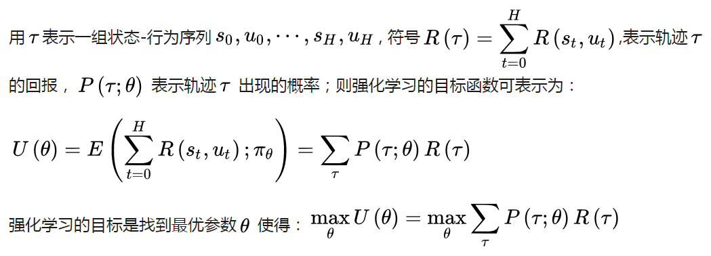
这时，策略搜索方法，实际上变成了一个优化问题。解决优化问题有很多种方法，比如：最速下降法，牛顿法，内点法等等。

其中最简单，也是最常用的是最速下降法，此处称为策略梯度的方法。
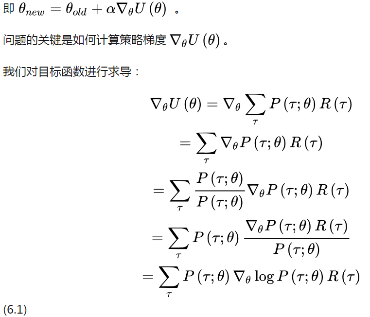

我们可以利用经验平均来进行估算:

### 1.2 从重要性采样的角度推导策略梯度
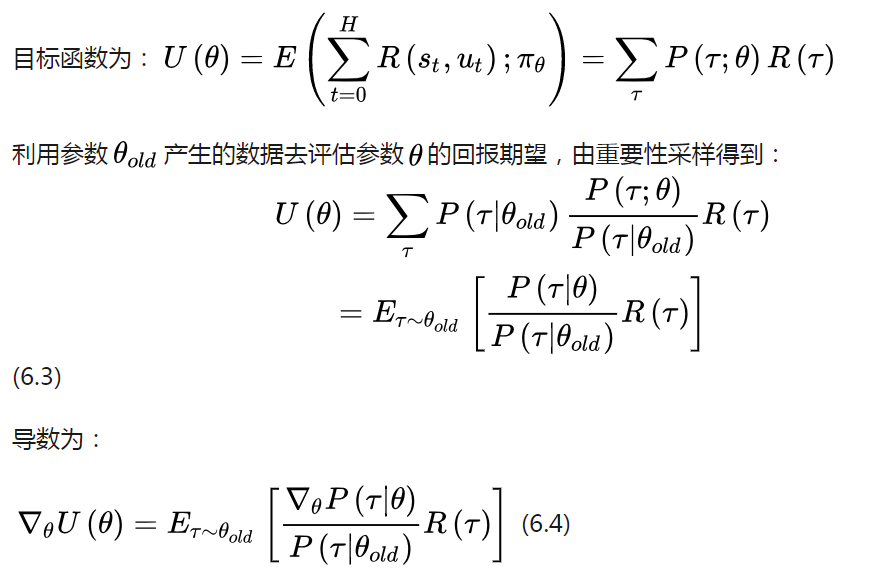
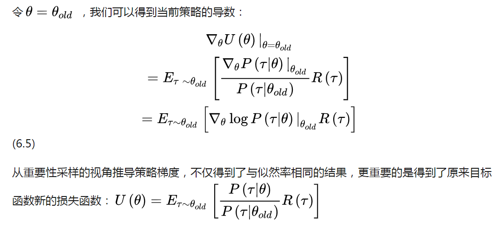

### 1.3 似然率策略梯度的直观理解
前面我们已经利用似然率的方法推导得到了策略梯度公式。
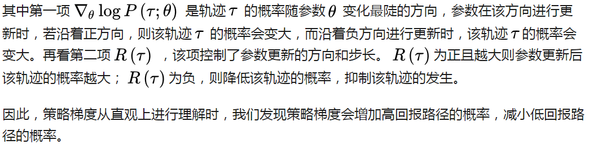

### 1.4 求似然率的梯度
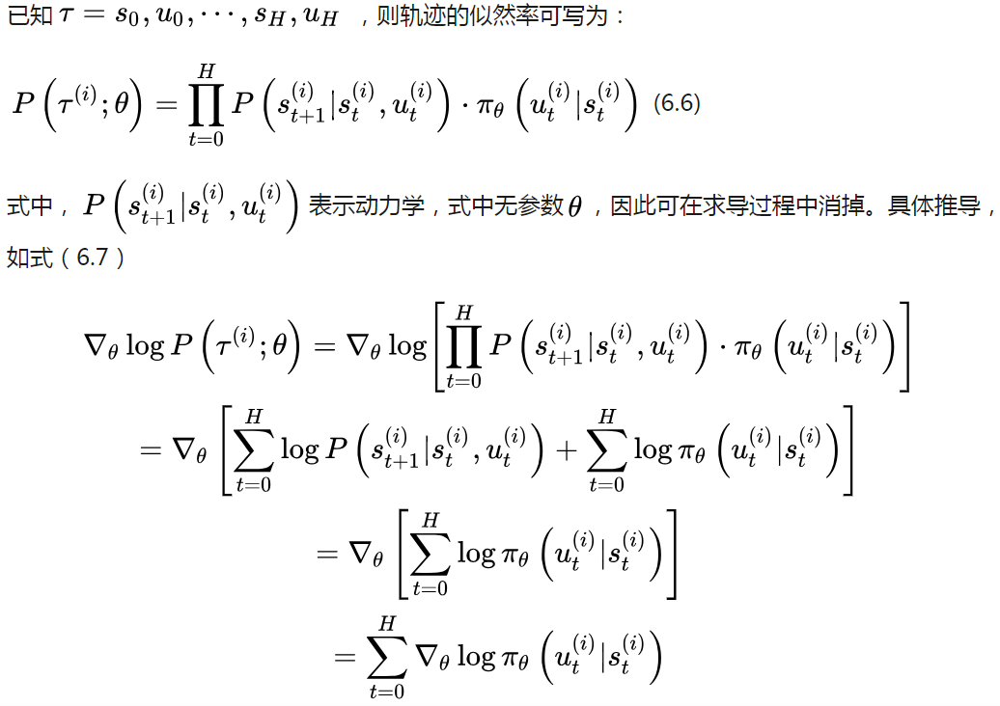
似然率梯度转化为动作策略的梯度，与动力学无关。

由此，我们已经推导出了策略梯度的计算公式：

（6.8）式给出的策略梯度是无偏的，但是方差很大。我们在回报中引入常数基线b来减小方差。

### 1.5 行动者-评论家（actor-critic）体系
上式取基线b为当前状态值函数，则为AC方法。
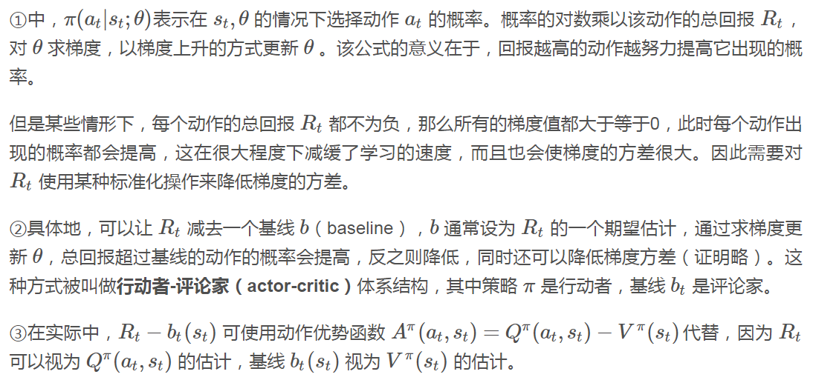

## 2. 异步AC

### 2.1 A3C(Asynchronous Advantage Actor Critic)
A3C的基本框架还是AC框架，只是它不在利用单个线程，而是利用多个线程。
每个线程相当于一个智能体在随机探索，多个智能体共同探索，并行计算策略梯度，维持一个总的更新量。
A3C算法不需要使用经验池来存储历史样本并随机抽取训练来打乱数据相关性，节约了存储空间，并且采用异步训练，大大加倍了数据的采样速度，也因此提升了训练速度。
与此同时，采用多个不同训练环境采集样本，样本的分布更加均匀，更有利于神经网络的训练。
.png)

### 2.2 A2C(Synchronous Advantage Actor Critic)
在A3C的基础上，OpenAI又提出了A2C(Synchronous Advantage Actor Critic)。
两个算法的不同点在于，在A3C中，每个智能体并行独立地更新全局网络，因此，在特定时间，智能体使用的网络权重与其他智能体是不同的，
这样导致每个智能体使用不同的策略在探索更多的环境。而在A2C中，所有并行智能体的更新先被统一收集起来，然后去更新全局网络，
全局网络更新完后再将权重分发到各个智能体。
为了鼓励探索，每个智能体最后执行的动作会被加入随机噪声。

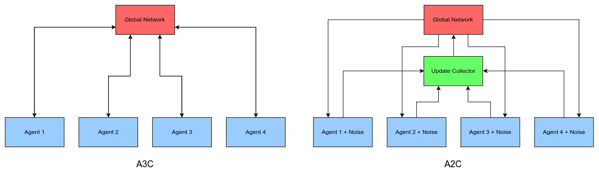

## 2. 置信域策略优化
TRPO是英文单词Trust region policy optimization的简称，翻译成中文是信赖域策略优化。

策略梯度算法的硬伤就在更新步长 α ，当步长不合适时，更新的参数所对应的策略是一个更不好的策略，当利用这个更不好的策略进行采样学习时，
再次更新的参数会更差，因此很容易导致越学越差，最后崩溃。所以，合适的步长对于强化学习非常关键。

什么叫合适的步长？

所谓合适的步长是指当策略更新后，回报函数的值不能更差。如何选择这个步长？或者说，如何找到新的策略使得新的回报函数的值单调增，或单调不减。这是TRPO要解决的问题。

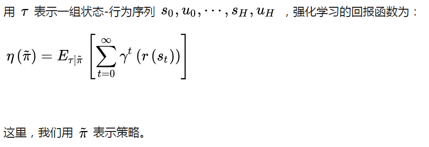
刚才已经说过，TRPO是找到新的策略，使得回报函数单调不减，一个自然地想法是能不能将新的策略所对应的回报函数分解成旧的策略所对应的回报函数+其他项。
只要新的策略所对应的其他项大于等于零，那么新的策略就能保证回报函数单调不减。
其实是存在这样的等式，这个等式是2002年Sham Kakade提出来的。TRPO的起点便是这样一个等式：
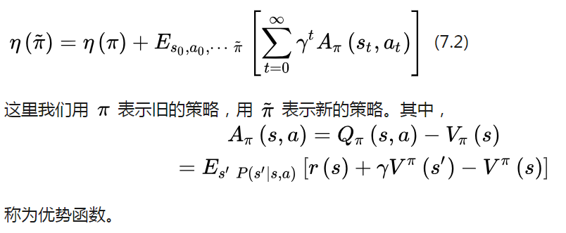
这里的优势指的是动作值函数相比于当前状态的值函数的优势。如果优势函数大于零，则说明该动作比平均动作好，如果优势函数小于零，则说明当前动作还不如平均动作好。
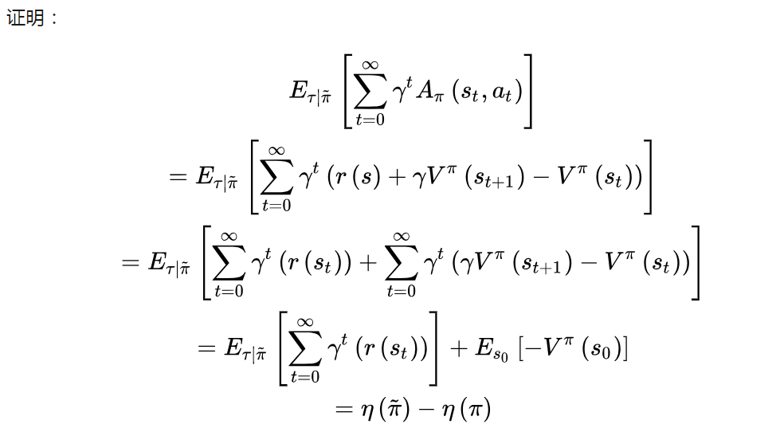
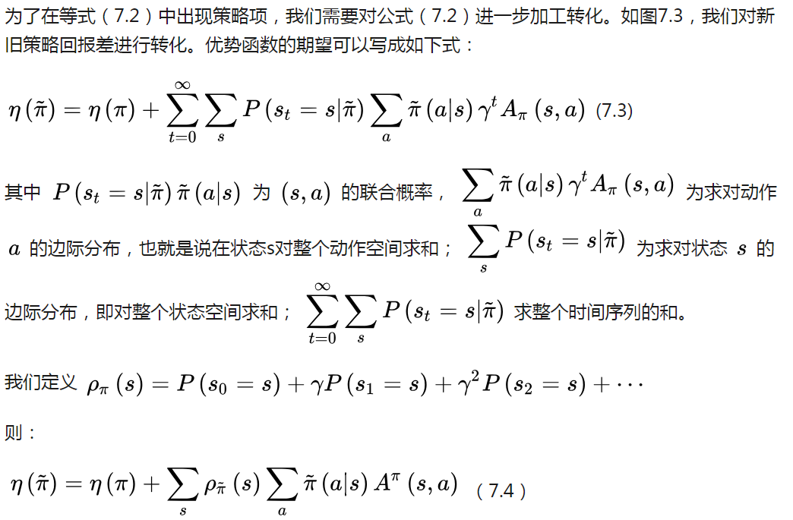

推导：

### 2.1 忽略状态分布的变化，依然采用旧的策略所对应的状态分布
这个技巧是对原代价函数的第一次近似。其实，当新旧参数很接近时，我们将用旧的状态分布代替新的状态分布也是合理的。这时，原来的代价函数变成了：

我们再看(7.5)式的第二项策略部分，这时的动作a是由新的策略产生。可是新的策略是带参数的，这个参数是未知的，因此无法用来产生动作。这时，我们引入TRPO的第二个技巧。

### 2.2 利用重要性采样对动作分布进行的处理
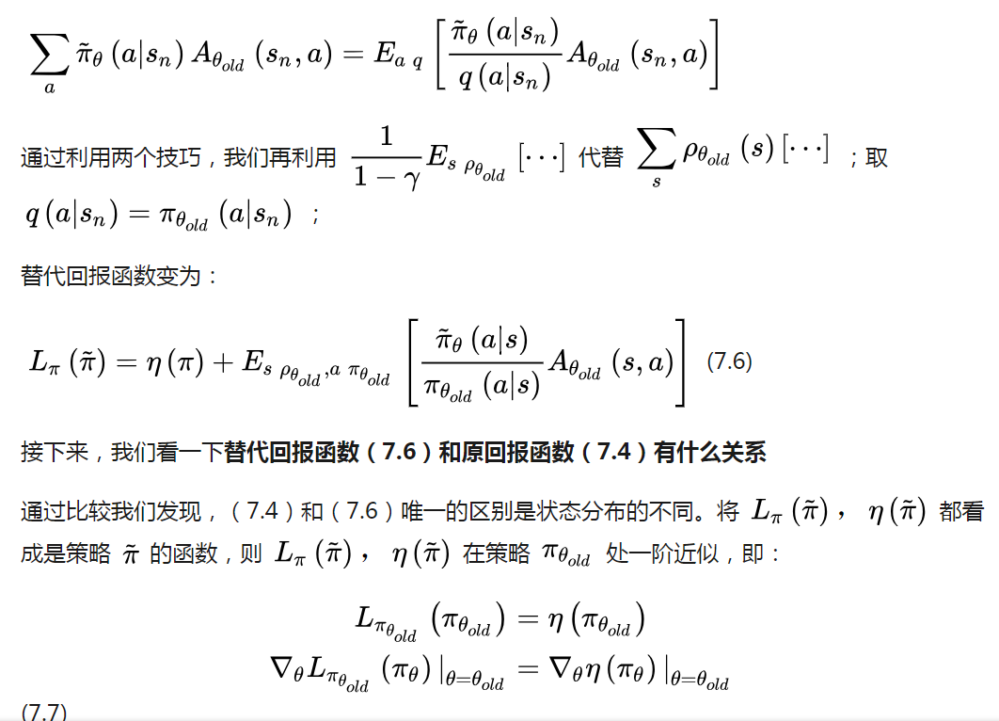
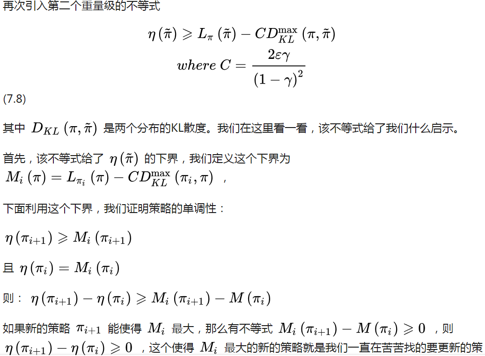
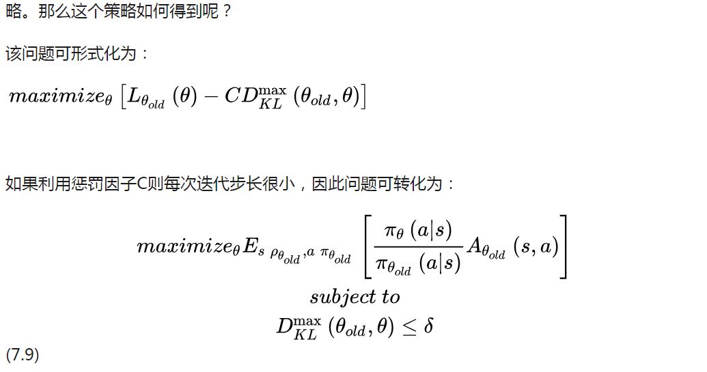

### 2.3 利用平均KL散度代替最大KL散度

### 2.4
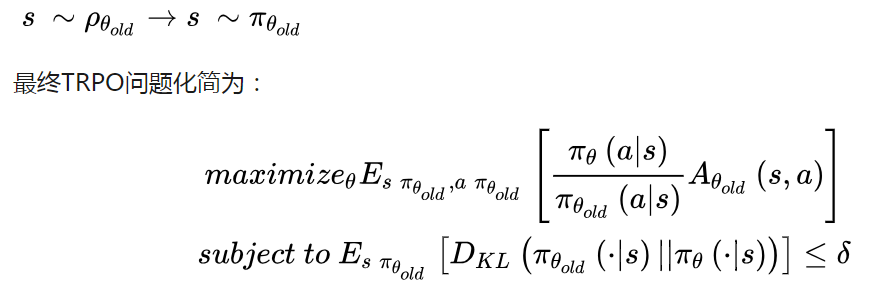
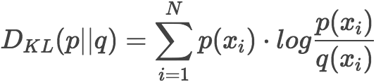

