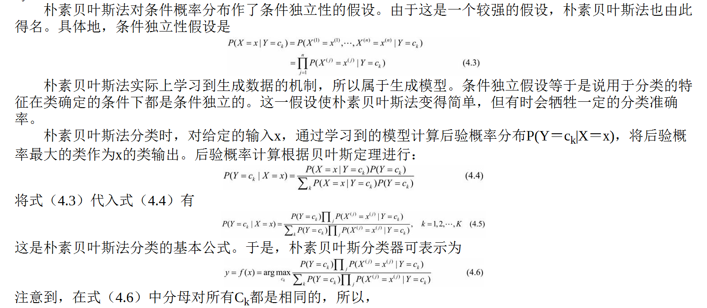

# 朴素贝叶斯法

朴素贝叶斯（naïve Bayes）法是基于**贝叶斯定理**与**特征条件独立假设**的分类方法。
对于给定的训练数据集，首先基于特征条件独立假设学习输入/输出的联合概率分布；然后基于此模型，对给定的输入x，利用贝叶斯定理求出后验概率最大的输出y。
朴素贝叶斯法实现简单，学习与预测的效率都很高，是一种常用的方法。

## 模型

## 为何要后验概率最大化？

## 算法

### 极大似然估计

在朴素贝叶斯法中，学习意味着估计P(Y＝ck)和P(X(j)＝x(j)|Y＝ck)。可以应用极大似然估计法估计相应的概率。

### 贝叶斯估计

用极大似然估计可能会出现所要估计的概率值为0的情况。这时会影响到后验概率的计算结果，使分类产生偏差。解决这一问题的方法是采用贝叶斯估计。
具体地，条件概率的贝叶斯估计是

