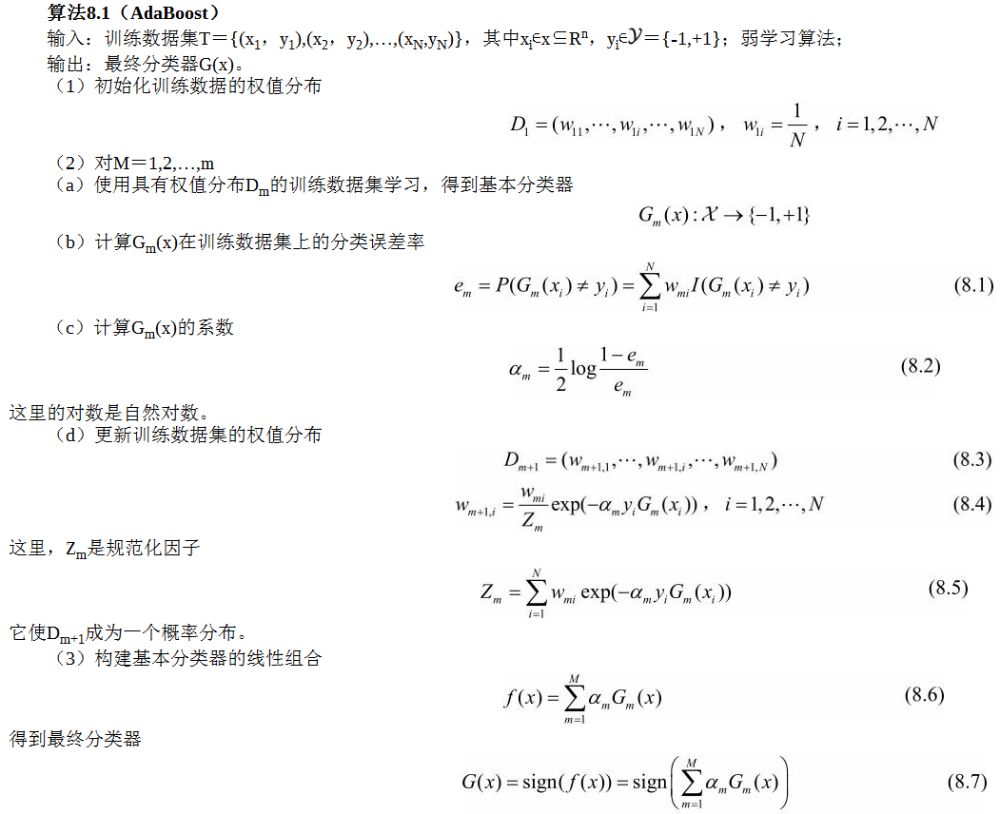
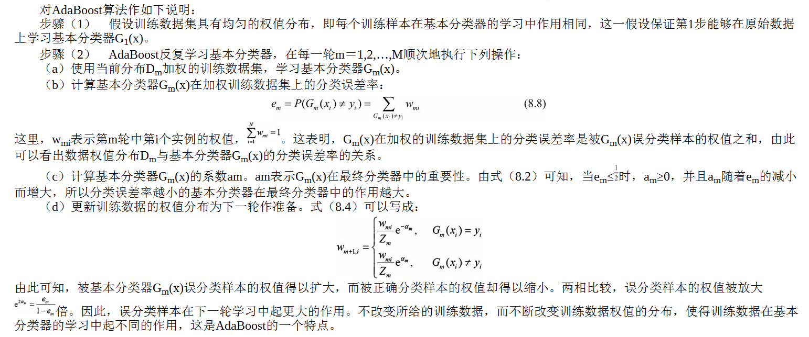
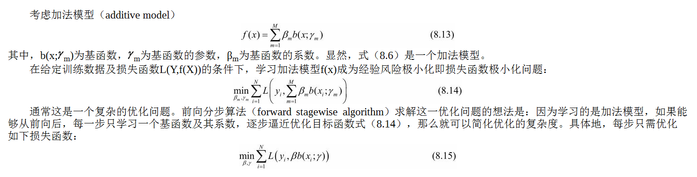
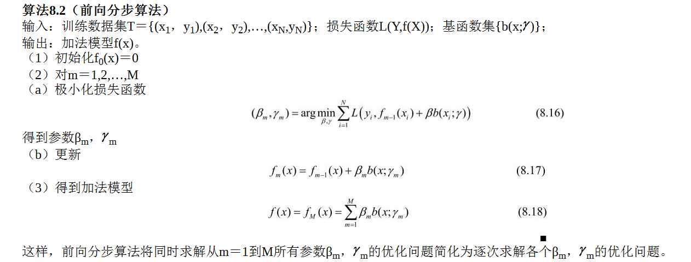
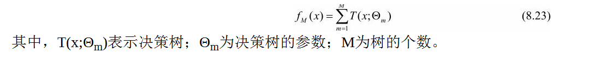
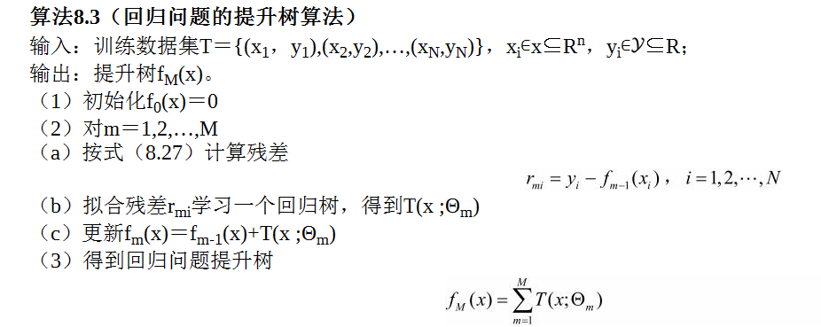
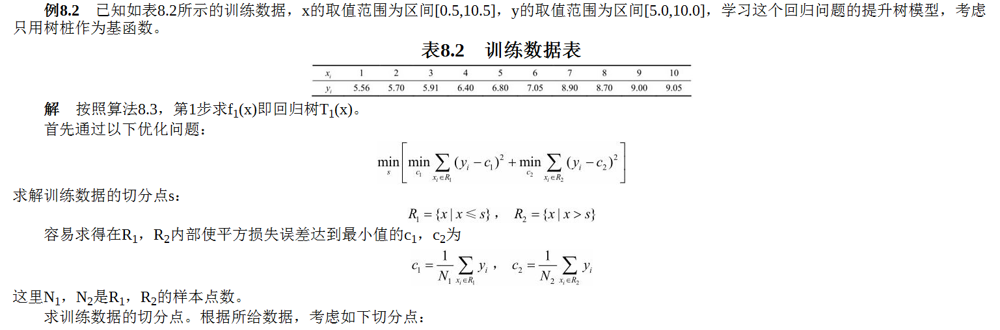
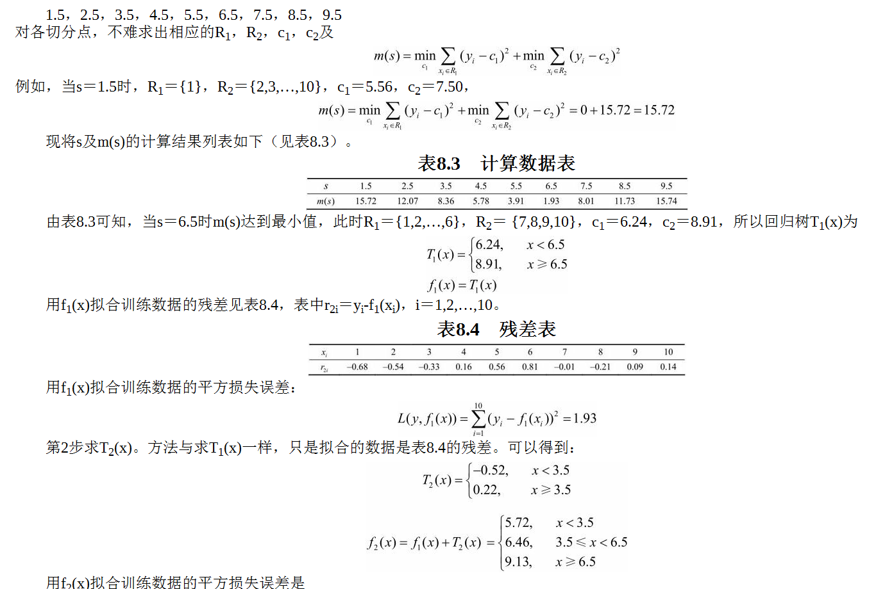
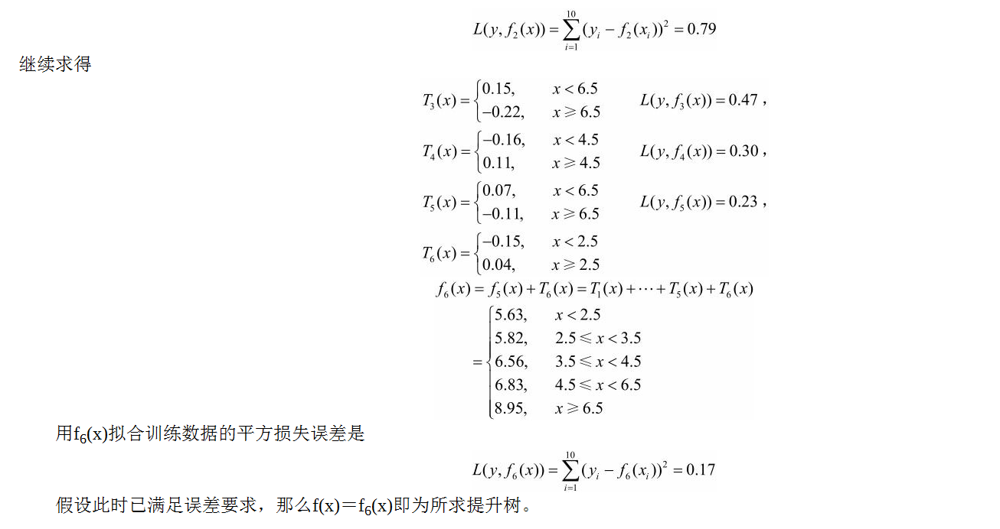
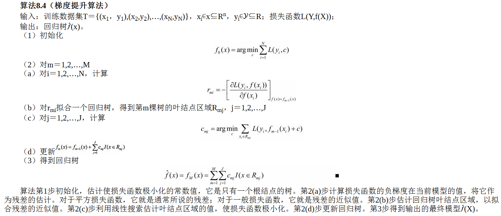

# 提升树

提升（boosting）方法通过**改变训练样本的权重**，学习多个分类器，并将这些分类器进行线性组合，提高分类的性能。

## 提升方法
提升方法基于这样一种思想：对于一个复杂任务来说，将多个专家的判断进行适当的综合所得出的判断，要比其中任何一个专家单独的判断好。
实际上，就是“三个臭皮匠顶个诸葛亮”的道理。

> 强可学习：一个概念（一个类），如果存在一个多项式的学习算法能够学习它，并且正确率很高，那么就称这个概念是强可学习的；
> 弱可学习：一个概念，如果存在一个多项式的学习算法能够学习它，学习的正确率仅比随机猜测略好，那么就称这个概念是弱可学习的。

Schapire后来证明强可学习与弱可学习是等价的，也就是说，在PAC学习的框架下，**一个概念是强可学习的充分必要条件是这个概念是弱可学习的**。

如果已经发现了“弱学习算法”，那么能否将它**提升（boost）为“强学习算法”**?
发现弱学习算法通常要比发现强学习算法容易得多。  那么如何具体实施提升，便成为开发提升方法时所要解决的问题。

大多数的提升方法都是改变训练数据的概率分布（训练数据的权值分布），针对不同的训练数据分布调用弱学习算法学习一系列弱分类器。

## AdaBoost

对提升方法来说，有两个问题需要回答：  1. 是在每一轮如何改变训练数据的权值或概率分布；  2. 如何将弱分类器组合成一个强分类器。

AdaBoost:
1. 提高那些被前一轮弱分类器错误分类样本的权值，而降低那些被正确分类样本的权值。
2. 弱分类器的组合，AdaBoost采取加权多数表决的方法。具体地，加大分类误差率小的弱分类器的权值，使其在表决中起较大的作用，减小分类误差率大的弱分类器的权值，使其在表决中起较小的作用。

一些说明：

步骤（3）　线性组合f(x)实现M个基本分类器的加权表决。系数am表示了基本分类器Gm(x)的重要性，这里，所有am之和并不为1。
f(x)的符号决定实例x的类，f(x)的绝对值表示分类的确信度。利用基本分类器的线性组合构建最终分类器是AdaBoost的另一特点。

**优点**：
1. AdaBoost的训练误差是以指数速率下降的。
2. AdaBoost具有适应性，即它能适应弱分类器各自的训练误差率。这也是它的名称（适应的提升）的由来，Ada是Adaptive的简写。

## 前向分步算法

AdaBoost算法是前向分歩加法算法的特例。这时，模型是由基本分类器组成的加法模型，损失函数是指数函数。

## 提升树
以决策树为基函数的提升方法称为提升树（boosting tree）。提升树模型可以表示为决策树的加法模型：

针对不同问题的提升树学习算法，其主要区别在于使用的损失函数不同。包括用平方误差损失函数的回归问题，用指数损失函数的分类问题，以及用一般损失函数的一般决策问题。

看这个例子

## 梯度提升树
当损失函数是平方损失和指数损失函数时，每一步优化是很简单的。但对一般损失函数而言，往往每一步优化并不那么容易。
针对这一问题，Freidman提出了梯度提升（gradient boosting）算法。
这是利用最速下降法的近似方法，其关键是利用损失函数的负梯度在当前模型的值作为回归问题提升树算法中的残差的近似值，拟合一个回归树。
如此说来，上面的提升树算法只是梯度提升树的一个特例（损失函数为平方误差函数，它的负梯度就是残差）

## Bagging与随机森林

Bagging是一种并行式的集成学习方法，即基学习器的训练之间没有前后顺序可以同时进行，Bagging使用“有放回”采样的方式选取训练集，
对于包含m个样本的训练集，进行m次有放回的随机采样操作，从而得到m个样本的采样集，这样训练集中有接近36.8%的样本没有被采到。
按照相同的方式重复进行，我们就可以采集到T个包含m个样本的数据集，从而训练出T个基学习器，最终对这T个基学习器的输出进行结合。

可以看出Bagging主要通过样本的扰动来增加基学习器之间的多样性，因此Bagging的基学习器应为那些对训练集十分敏感的不稳定学习算法，
例如：神经网络与决策树等。从偏差-方差分解来看，Bagging算法主要关注于降低方差，即通过多次重复训练提高稳定性。
不同于AdaBoost的是，Bagging可以十分简单地移植到多分类、回归等问题。总的说起来则是：AdaBoost关注于降低偏差，而Bagging关注于降低方差。

随机森林（Random Forest）是Bagging的一个拓展体，它的基学习器固定为决策树，多棵树也就组成了森林，而“随机”则在于选择划分属性的随机，
随机森林在训练基学习器时，也采用有放回采样的方式添加样本扰动，同时它还引入了一种属性扰动，即在基决策树的训练过程中，在选择划分属性时，
RF先从候选属性集中随机挑选出一个包含K个属性的子集，再从这个子集中选择最优划分属性，一般推荐K=log2（d）。

这样随机森林中基学习器的多样性不仅来自样本扰动，还来自属性扰动，从而进一步提升了基学习器之间的差异度。
相比决策树的Bagging集成，随机森林的起始性能较差（由于属性扰动，基决策树的准确度有所下降），但随着基学习器数目的增多，
随机森林往往会收敛到更低的泛化误差。同时不同于Bagging中决策树从所有属性集中选择最优划分属性，随机森林只在属性集的一个子集中选择划分属性，
因此训练效率更高。