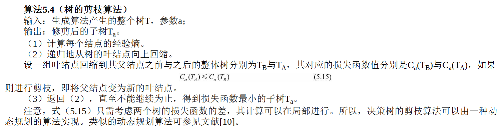

# 决策树

决策树模型呈树形结构，在分类问题中，表示基于特征对实例进行分类的过程。
它可以认为是**if-then规则的集合**，也可以认为是定义在特征空间与类空间上的**条件概率分布**。
其主要优点是模型具有可读性，分类速度快。学习时，利用训练数据，根据损失函数最小化的原则建立决策树模型。
预测时，对新的数据，利用决策树模型进行分类。决策树学习通常包括3个步骤：特征选择、决策树的生成和决策树的修剪。

## 模型
分类决策树模型是一种描述对实例进行分类的树形结构。决策树由结点（node）和有向边（directed edge）组成。
结点有两种类型：内部结点（internal node）和叶结点（leaf node）。
**内部结点表示一个特征或属性，叶结点表示一个类。**
用决策树分类，从根结点开始，对实例的某一特征进行测试，根据测试结果，将实例分配到其子结点；
这时，每一个子结点对应着该特征的一个取值。如此递归地对实例进行测试并分配，直至达到叶结点。最后将实例分到叶结点的类中。

### 决策树与if-then规则
决策树的路径或其对应的if-then规则集合具有一个重要的性质：互斥并且完备。
这就是说，每一个实例都被一条路径或一条规则所覆盖，而且只被一条路径或一条规则所覆盖。

### 决策树与条件概率分布
决策树还表示给定特征条件下类的条件概率分布。这一条件概率分布定义在特征空间的一个划分（partition）上。
将特征空间划分为互不相交的单元（cell）或区域（region），并在每个单元定义一个类的概率分布就构成了一个条件概率分布。

当某个单元c的条件概率满足P(Y＝+1|X＝c)>0.5时，则认为这个单元属于正类，即落在这个单元的实例都被视为正例。

### 决策树学习

**决策树学习本质上是从训练数据集中归纳出一组分类规则。**我们需要的是一个与训练数据矛盾较小的决策树，同时具有很好的泛化能力。
决策树学习的损失函数通常是正则化的极大似然函数。
当损失函数确定以后，学习问题就变为在损失函数意义下选择最优决策树的问题。
因为从所有可能的决策树中选取最优决策树是NP完全问题，所以现实中决策树学习算法通常采用启发式方法，近似求解这一最优化问题。
这样得到的决策树是**次最优**（sub-optimal）的。
决策树学习的算法通常是一个递归地选择最优特征，并根据该特征对训练数据进行分割，使得对各个子数据集有一个最好的分类的过程。
这一过程对应着对特征空间的划分，也对应着决策树的构建。
开始，构建根结点，将所有训练数据都放在根结点。
选择一个最优特征，按照这一特征将训练数据集分割成子集，使得各个子集有一个在当前条件下最好的分类。
如果这些子集已经能够被基本正确分类，那么构建叶结点，并将这些子集分到所对应的叶结点中去；如果还有子集不能被基本正确分类，那么就对这些子集选择新的最优特征，继续对其进行分割，构建相应的结点。
如此递归地进行下去，直至所有训练数据子集被基本正确分类，或者没有合适的特征为止。
最后每个子集都被分到叶结点上，即都有了明确的类。这就生成了一棵决策树。

以上方法生成的决策树可能对训练数据有很好的分类能力，但对未知的测试数据却未必有很好的分类能力，即可能发生过拟合现象。
我们需要对已生成的树自下而上进行剪枝，将树变得更简单，从而使它具有更好的泛化能力。
具体地，就是去掉过于细分的叶结点，使其回退到父结点，甚至更高的结点，然后将父结点或更高的结点改为新的叶结点。

如果特征数量很多，也可以在决策树学习开始的时候，对特征进行选择，只留下对训练数据有足够分类能力的特征。

决策树学习算法包含特征选择、决策树的生成与决策树的剪枝过程。
由于决策树表示一个条件概率分布，所以深浅不同的决策树对应着不同复杂度的概率模型。

决策树的生成只考虑局部最优，相对地，决策树的剪枝则考虑全局最优。

## 特征选择
特征选择是决定用哪个特征来划分特征空间。

问题是：究竟选择哪个特征更好些？这就要求确定选择特征的准则。

### 熵
熵（entropy）是表示随机变量不确定性的度量。
设X是一个取有限个值的离散随机变量，其概率分布为

则随机变量X的熵定义为

**熵只依赖于X的分布**

条件熵H(Y|X)表示在已知随机变量X的条件下随机变量Y的不确定性。
随机变量X给定的条件下随机变量Y的条件熵（conditional entropy）H(Y|X)，定义为X给定条件下Y的条件概率分布的熵对X的数学期望

这里，pi＝P(X＝xi)，i＝1,2,…,n。
当熵和条件熵中的概率由数据估计（特别是极大似然估计）得到时，所对应的熵与条件熵分别称为经验熵（empirical entropy）和经验条件熵（empirical conditional entropy）。

### 信息增益(互信息)
信息增益（information gain）表示得知特征X的信息而使得类Y的信息的不确定性减少的程度。
特征A对训练数据集D的信息增益g(D,A)，定义为集合D的经验熵H(D)与特征A给定条件下D的经验条件熵H(D|A)之差，即

根据信息增益准则的**特征选择方法**是：对训练数据集（或子集）D，计算其每个特征的信息增益，并比较它们的大小，选择信息增益最大的特征。

设训练数据集为D，|D|表示其样本容量，即样本个数。设有K个类Ck，k＝1,2,…,K，|Ck|为属于类Ck的样本个数.
根据特征A的取值将D划分为n个子集D1,D2,…,Dn，|Di|为Di的样本个数.
记子集Di中属于类Ck的样本的集合为Dik，|Dik|为Dik的样本个数.

### 信息增益比
信息增益偏向于选择取值较多的特征，信息增益比（information gain ratio）可以对这一问题进行校正。

## 决策树生成

## 决策树剪枝

### 基尼指数(越小，特征越优)

