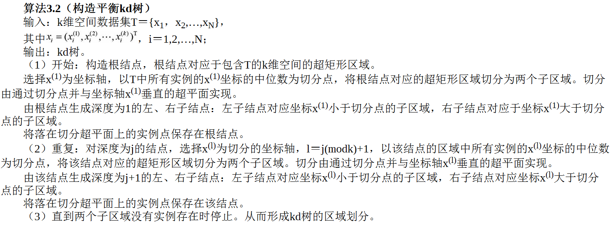
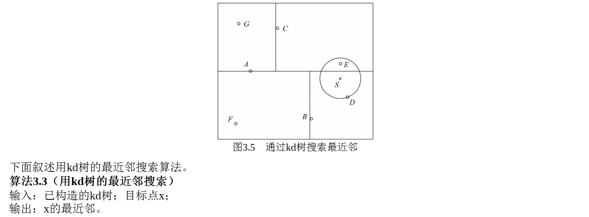

# k近邻法

k近邻法假设给定一个训练数据集，其中的实例类别已定。分类时，对新的实例，根据其k个最近邻的训练实例的类别，通过多数表决等方式进行预测。
因此，**k近邻法不具有显式的学习过程**。
k近邻法实际上利用训练数据集对特征向量空间进行划分，并作为其分类的“模型”。
k值的选择、距离度量及分类决策规则是k近邻法的三个基本要素。

## 模型
k近邻法中，当训练集、距离度量（如欧氏距离）、k值及分类决策规则（如多数表决）确定后，对于任何一个新的输入实例，它所属的类唯一地确定。
这相当于根据上述要素将特征空间划分为一些子空间，确定子空间里的每个点所属的类。

## 距离度量
特征空间中两个实例点的距离是两个实例点相似程度的反映。
k近邻模型的特征空间一般是n维实数向量空间Rn。使用的距离是欧氏距离，但也可以是其他距离，如更一般的Lp距离（Lp distance）。

## k值的选择
k值的选择会对k近邻法的结果产生重大影响。

如果选择较小的k值，就相当于用较小的邻域中的训练实例进行预测，“学习”的近似误差（approximation error）会减小，只有与输入实例较近的（相似的）训练实例才会对预测结果起作用。
但缺点是“学习”的估计误差（estimation error）会增大，预测结果会对近邻的实例点非常敏感。
如果邻近的实例点恰巧是噪声，预测就会出错。
换句话说，k值的减小就意味着整体模型变得复杂，容易发生过拟合。

如果选择较大的k值，就相当于用较大邻域中的训练实例进行预测。其优点是可以减少学习的估计误差。但缺点是学习的近似误差会增大。
这时与输入实例较远的（不相似的）训练实例也会对预测起作用，使预测发生错误。k值的增大就意味着整体的模型变得简单。

在应用中，k值一般取一个比较小的数值。通常采用交叉验证法来选取最优的k值。

## 分类决策规则
k近邻法中的分类决策规则往往是多数表决，即由输入实例的k个邻近的训练实例中的多数类决定输入实例的类。

## 实现：kd树
实现k近邻法时，主要考虑的问题是如何对训练数据进行快速k近邻搜索。这点在特征空间的维数大及训练数据容量大时尤其必要。
为了提高k近邻搜索的效率，可以考虑使用特殊的结构存储训练数据，以减少计算距离的次数。
kd树是一种对k维空间中的实例点进行存储以便对其进行快速检索的树形数据结构。kd树是二叉树，表示对k维空间的一个划分（partition）。构造kd树相当于不断地用垂直于坐标轴的超平面将k维空间切分，构成一系列的k维超矩形区域。
通常，依次选择坐标轴对空间切分，选择训练实例点在选定坐标轴上的中位数（median）为切分点，这样得到的kd树是平衡的。
注意，平衡的kd树搜索时的效率未必是最优的。

