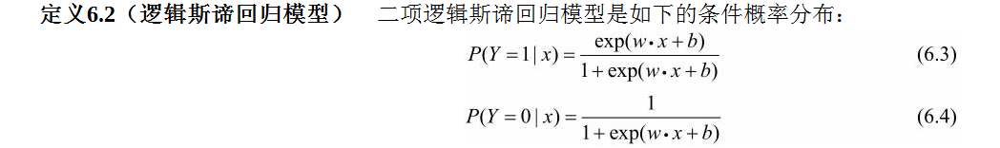
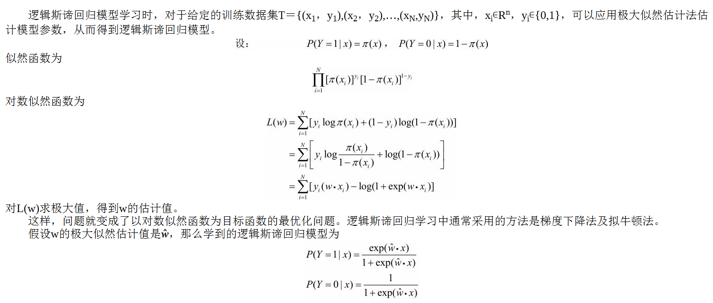
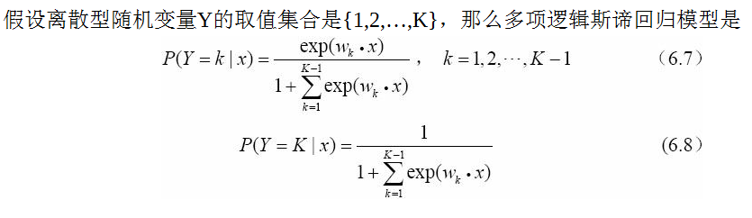

# 逻辑回归

## 1. 逻辑分布
设X是连续随机变量，X服从逻辑斯谛分布是指X具有下列分布函数：

式中，u为位置参数，r>0为形状参数。曲线在中心附近增长速度较快，在两端增长速度较慢。形状参数的值越小，曲线在中心附近增长得越快。

## 二项逻辑回归

对于给定的输入实例x，按照式（6.3）和式（6.4）可以求得P(Y＝1|x)和P(Y＝0|x)。逻辑斯谛回归比较两个条件概率值的大小，将实例x分到概率值较大的那一类。
线性函数的值越接近正无穷，概率值就越接近1；线性函数的值越接近负无穷，概率值就越接近0（如图6.1所示）。这样的模型就是逻辑斯谛回归模型。

## 模型参数估计

## 多项逻辑回归
