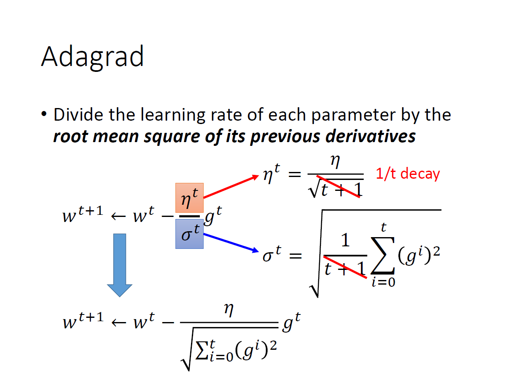
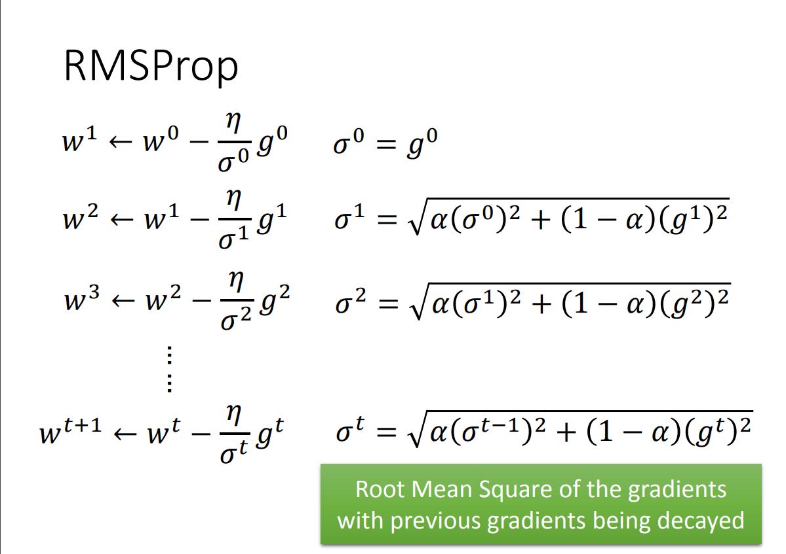
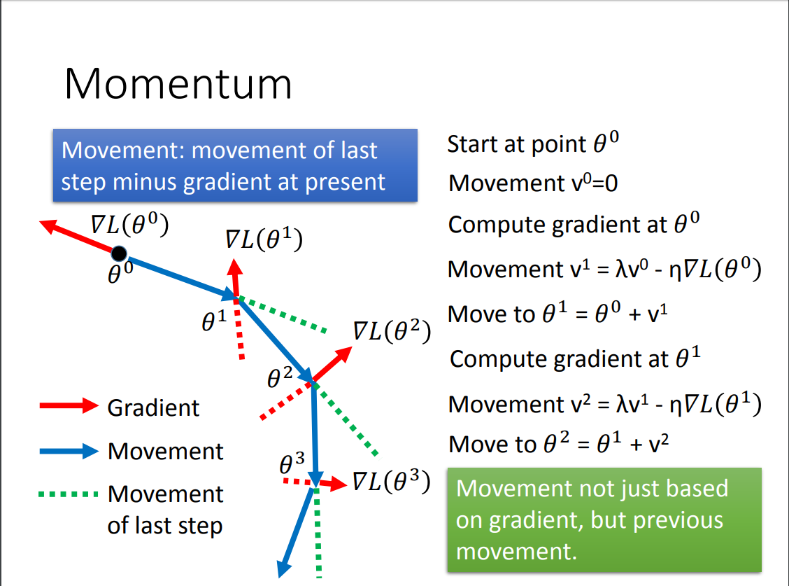
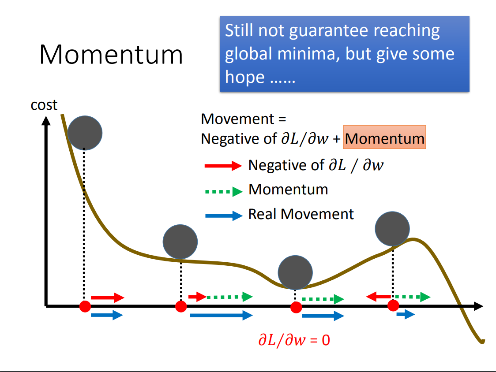
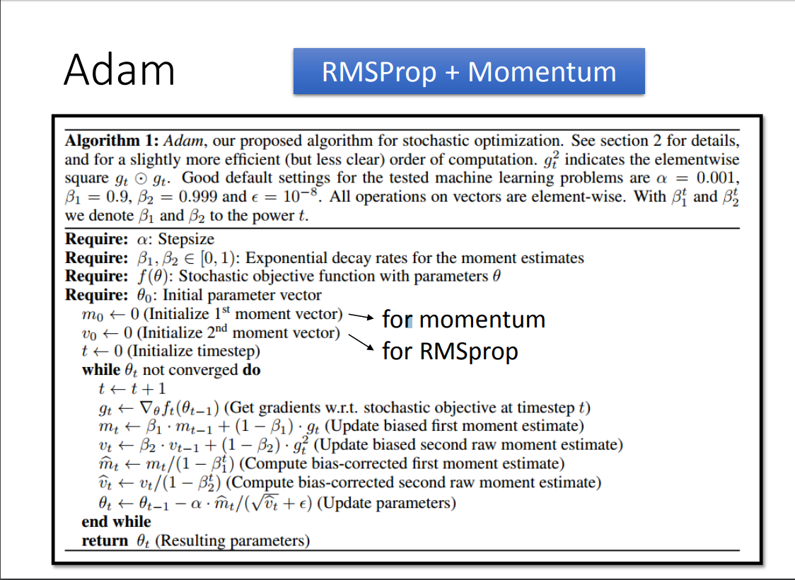

# 梯度下降法

## 1. 按照每次迭代取的样本数来分

**Batch Gradient Descent 全量梯度下降**

每次都取整个训练集的样本来更新。
缺点:计算慢，不能在线更新模型。

**Stochastic gradient descent 随机梯度下降**

每次只取训练集中的1个样本进行训练。
优点：训练速度快，模型可在线更新，能够有几率跳出局部最小点。
缺点：单个样本训练出来的gradient波动比较大。

**Mini-batch gradient descent 小批量梯度下降**

每次取一小撮样本来更新参数。
优点：一定程度上克服了前两个的缺点，训练相对稳定且速度快。

## 2. 按照学习率调节方法来分

梯度下降最关键的问题在于学习率：
一是学习率大了会导致不能收敛，在极值点附近震荡，学习率小了收敛速度慢。
二是传统的学习率是定死的，每个特征的学习率都一样。
为了解决这个学习率的问题，众位先贤相出了很多不同的办法来调节学习率，核心的目的就是：让学习率自动自适应调节。

### Adagrad

### RMSprop

### momentum
基于动量的参数更新每次减掉的不是梯度，而是动量，而动量又是上一次动量和这一次梯度×学习率的和，因此是参数的更新具有了一定的惯性。

### Adam
Adam(Adaptive Moment Estimation)本质上是带有动量项的RMSprop，它利用梯度的一阶矩估计和二阶矩估计动态调整每个参数的学习率。Adam的优点主要在于经过偏置校正后，每一次迭代学习率都有个确定范围，使得参数比较平稳。
