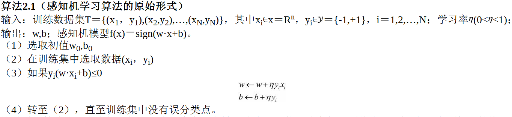
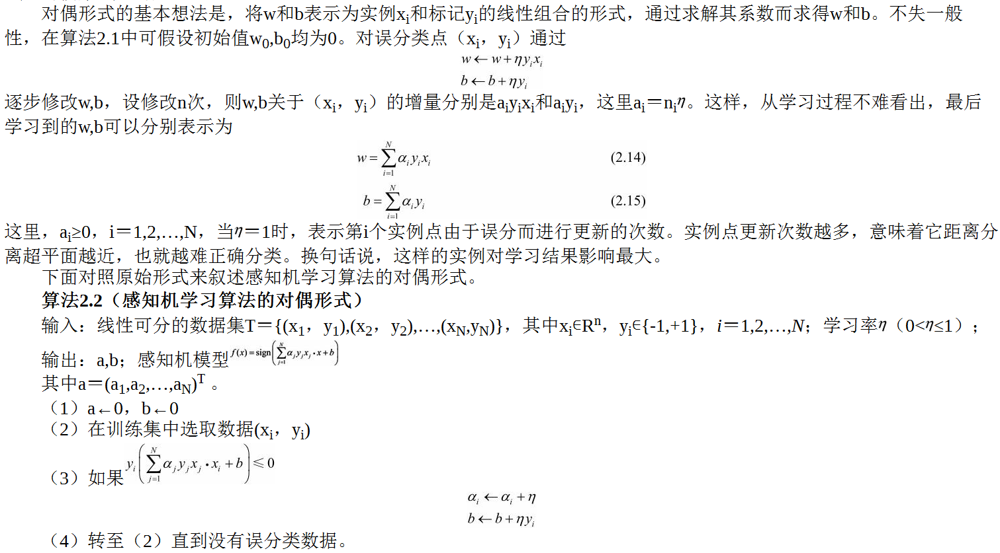

# 感知机

感知机（perceptron）是二类分类的线性分类模型，其输入为实例的特征向量，输出为实例的类别，取+1和–1二值。
感知机对应于输入空间（特征空间）中将实例划分为正负两类的分离超平面，属于判别模型。
## 模型
假设输入空间（特征空间）是X⊆Rn，输出空间是 Y＝{+1,-1}。输入x∊X表示实例的特征向量，对应于输入空间（特征空间）的点；
输出y∊Y表示实例的类别。由输入空间到输出空间的如下函数

## 损失函数
损失函数的一个自然选择是误分类点的总数。但是，这样的损失函数不是参数w,b的连续可导函数，不易优化。损失函数的另一个选择是误分类点到超平面S的总距离，这是感知机所采用的。

感知机sign(w·x+b)学习的损失函数定义为

## 优化算法
感知机学习算法是误分类驱动的，具体采用随机梯度下降法（stochastic gradient descent）。

