# 支持向量机

支持向量机（support vector machines，SVM）的基本模型是定义在特征空间上的间隔最大的线性分类器，**间隔最大使它有别于感知机**；
支持向量机还包括核技巧，这使它成为实质上的非线性分类器。
支持向量机的学习策略就是间隔最大化。

支持向量机学习方法包含构建由简至繁的模型：
当训练数据线性可分时，通过硬间隔最大化（hard margin maximization），学习一个线性的分类器，即**线性可分支持向量机**，又称为硬间隔支持向量机；
当训练数据近似线性可分时，通过软间隔最大化（soft margin maximization），也学习一个线性的分类器，即**线性支持向量机**，又称为软间隔支持向量机；
当训练数据线性不可分时，通过使用核技巧（kernel trick）及软间隔最大化，学习**非线性支持向量机**。

核函数（kernel function）表示将输入从输入空间映射到特征空间得到的**特征向量之间的内积**。
通过使用核函数可以学习非线性支持向量机，等价于隐式地**在高维的特征空间中学习线性支持向量机**。
这样的方法称为核技巧。

输入都由输入空间转换到特征空间，支持向量机的学习是在特征空间进行的。
线性可分支持向量机、线性支持向量机假设这**两个空间的元素一一对应**，并将输入空间中的输入映射为特征空间中的特征向量。
非线性支持向量机利用一个从输入空间到特征空间的**非线性映射**将输入映射为特征向量。

## 1. 线性可分支持向量机

学习的目标是在特征空间中找到一个**分离超平面**，能将实例分到不同的类。
分离超平面对应于方程w·x+b＝0，它由法向量w和截距b决定，可用(w,b)来表示。
分离超平面将特征空间划分为两部分，一部分是正类，一部分是负类。法向量指向的一侧为正类，另一侧为负类。
一般地，当训练数据集线性可分时，存在无穷个分离超平面可将两类数据正确分开。
**感知机**利用误分类最小的策略，求得分离超平面，不过这时的解有无穷多个。
线性可分支持向量机利用**间隔最大化**求最优分离超平面，这时，解是**唯一**的。

### 1.1 间隔
#### 函数间隔

一般来说，一个点距离分离超平面的远近可以表示分类预测的确信程度。
在超平面w·x+b＝0确定的情况下，|w·x+b|能够相对地表示点x距离超平面的远近。而w·x+b的符号与类标记y的符号是否一致能够表示分类是否正确。
所以可用量y(w·x+b)来表示分类的**正确性及确信度**，这就是函数间隔（functional margin）的概念。
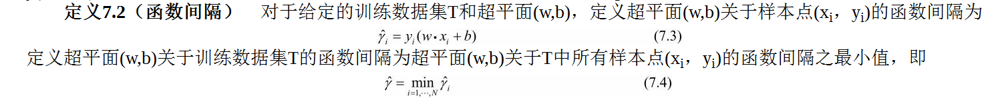

如果成比例地改变w和b，例如将它们改为2w和2b，超平面并没有改变，但函数间隔却成为原来的2倍。
所以选择分离超平面时，只有函数间隔还不够。

我们对分离超平面的法向量w加某些约束，如规范化，||w||＝ 1，使得间隔是确定的。这时函数间隔成为几何间隔（geometric margin）。
其中，||w||为w的L2范数。

#### 几何间隔
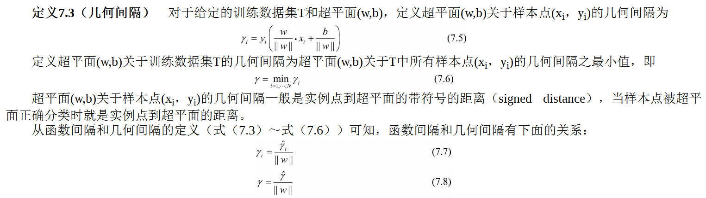

如果超平面参数w和b成比例地改变（超平面没有改变），函数间隔也按此比例改变，而几何间隔不变。

### 1.2 间隔最大化
间隔最大化的直观解释是：对训练数据集找到几何间隔最大的超平面意味着以**充分大的确信度**对训练数据进行分类。
也就是说，不仅将正负实例点分开，而且对最难分的实例点（离超平面最近的点）也有足够大的确信度将它们分开。
这样的超平面应该对未知的新实例有很好的分类预测能力。

#### 如何求得一个几何间隔最大的分离超平面？
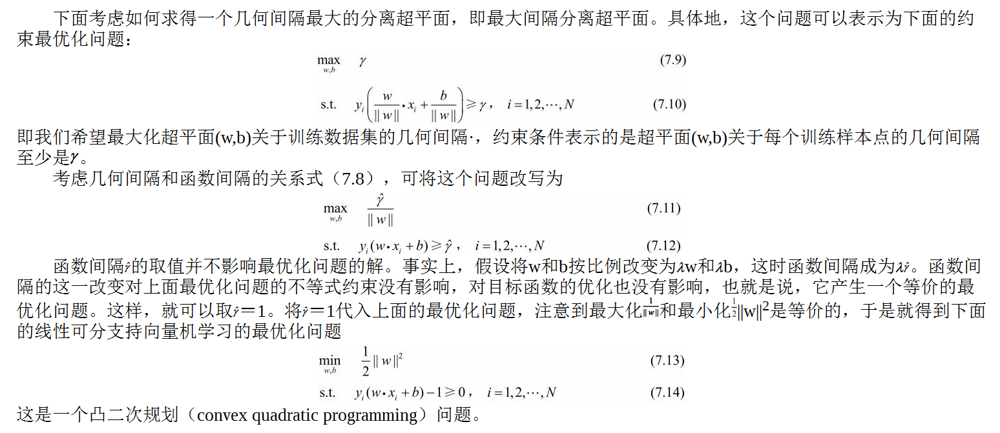
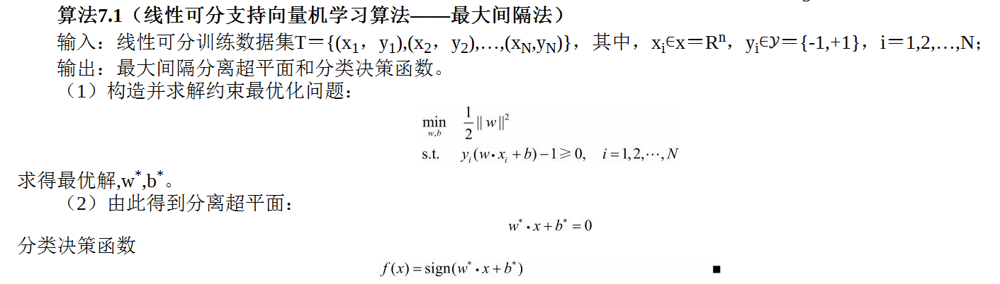

#### 支持向量
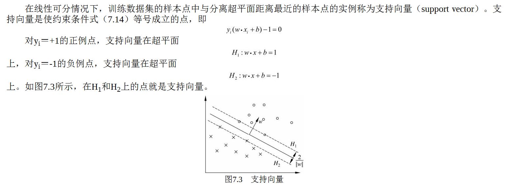

在决定分离超平面时**只有支持向量起作用**，而其他实例点并不起作用。
如果移动支持向量将改变所求的解；但是如果在间隔边界以外移动其他实例点，甚至去掉这些点，则解是不会改变的。
由于支持向量在确定分离超平面中起着决定性作用，所以将这种分类模型称为支持向量机。
支持向量的个数一般很少，所以支持向量机由很少的“重要的”训练样本确定。

#### 间隔边界
H1和H2平行，并且没有实例点落在它们中间。在H1与H2之间形成一条长带，**分离超平面与它们平行且位于它们中央**。
长带的宽度，即H1与H2之间的距离称为间隔（margin）。间隔依赖于分离超平面的法向量w，等于 2/||w||.H1和H2称为间隔边界。

### 1.3 拉格朗日乘子法
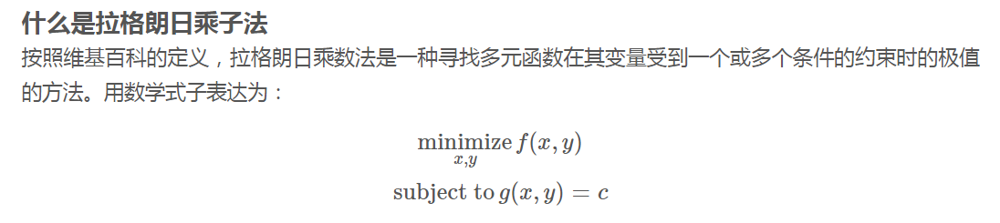
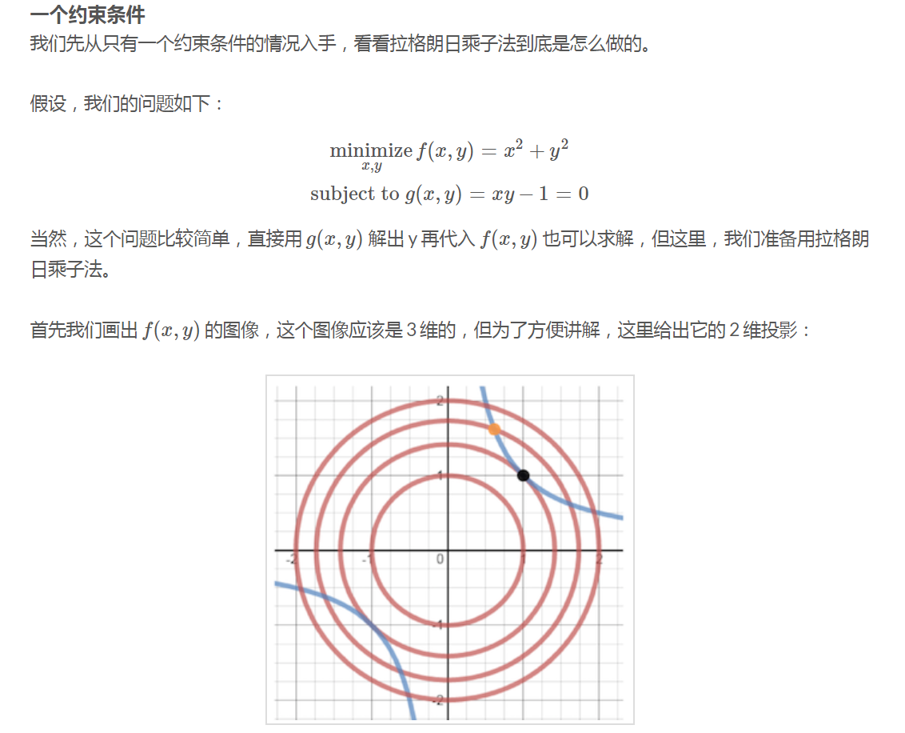
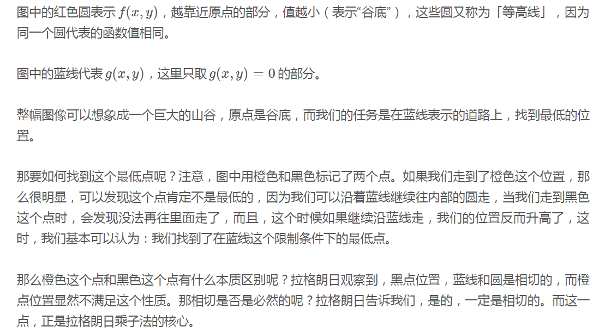
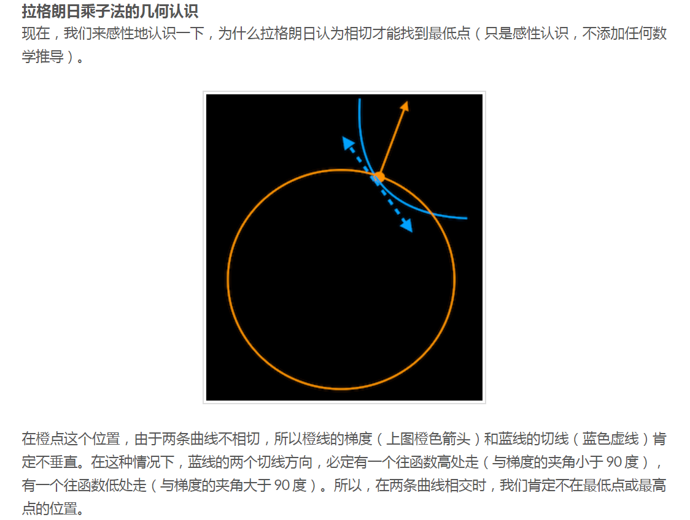
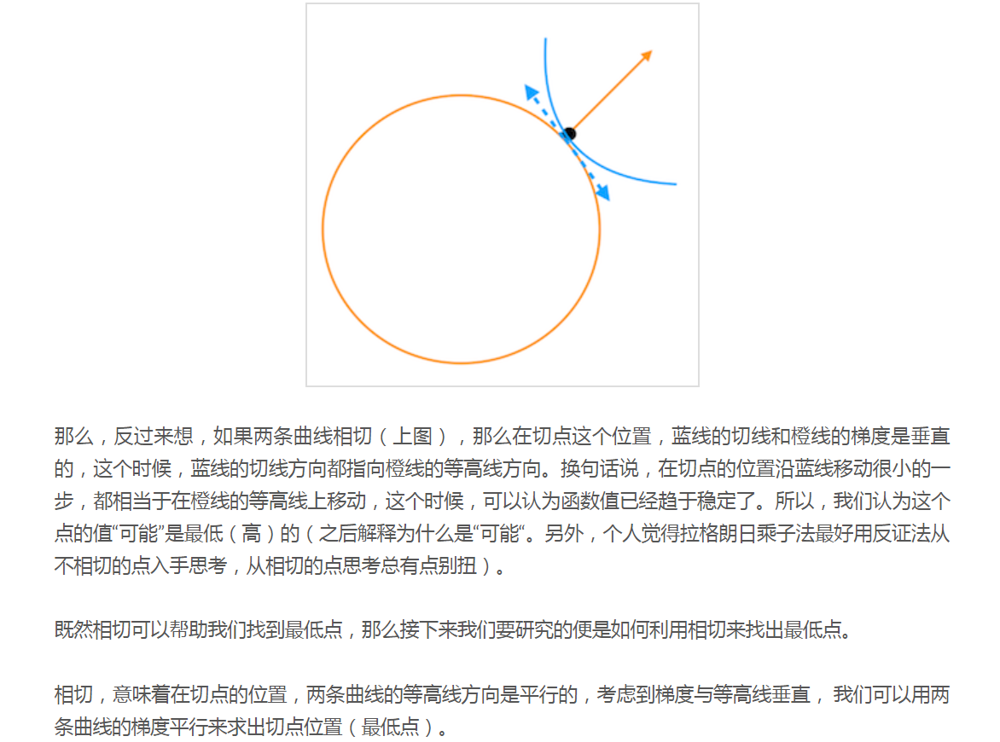
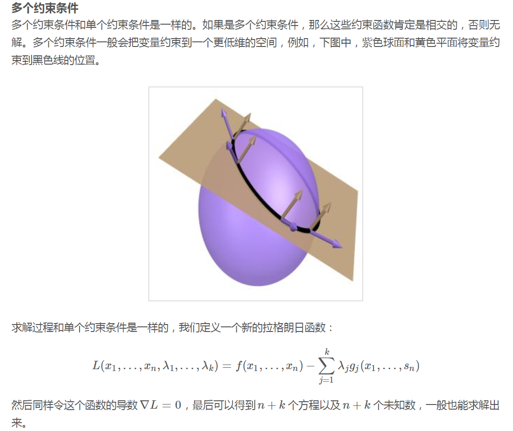

### 1.4 对偶算法
为了求解线性可分支持向量机的最优化问题（7.13）～（7.14），将它作为原始最优化问题，应用拉格朗日对偶性，
通过求解对偶问题（dual problem）得到原始问题（primal problem）的最优解，这就是线性可分支持向量机的对偶算法（dual algorithm）。
这样做的优点，一是对偶问题往往更容易求解；二是自然引入核函数，进而推广到非线性分类问题。

首先构建拉格朗日函数（Lagrange function）。
为此，对每一个不等式约束（7.14）引进拉格朗日乘子（Lagrange multiplier）ai≥0，i＝1,2,…,N，定义拉格朗日函数：
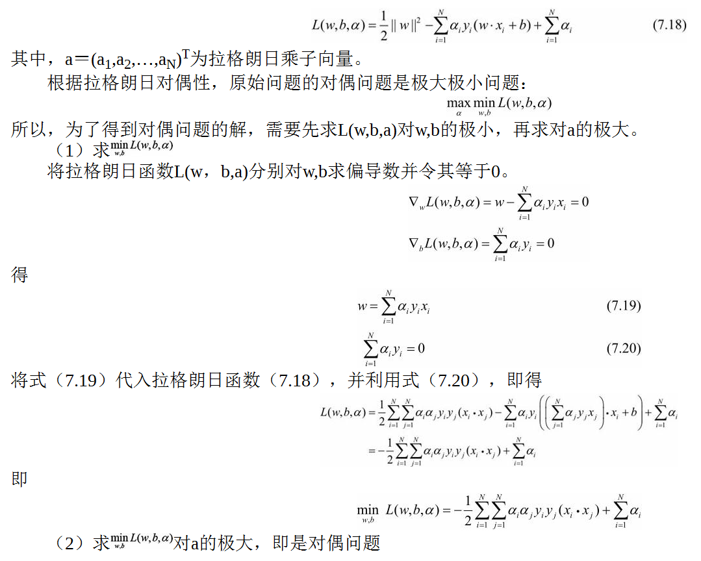
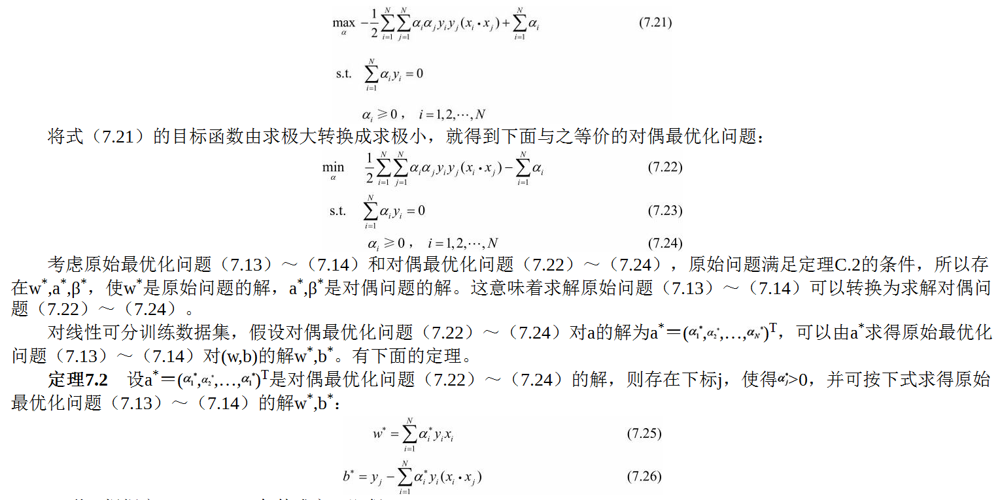
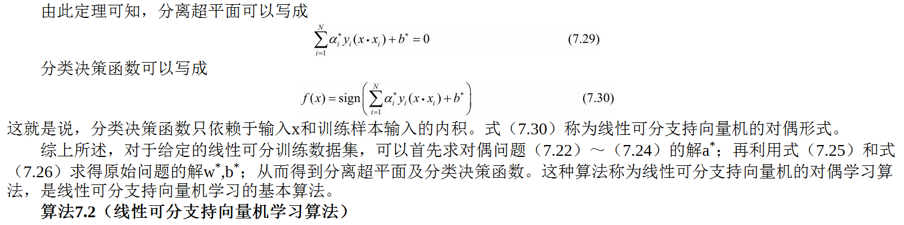
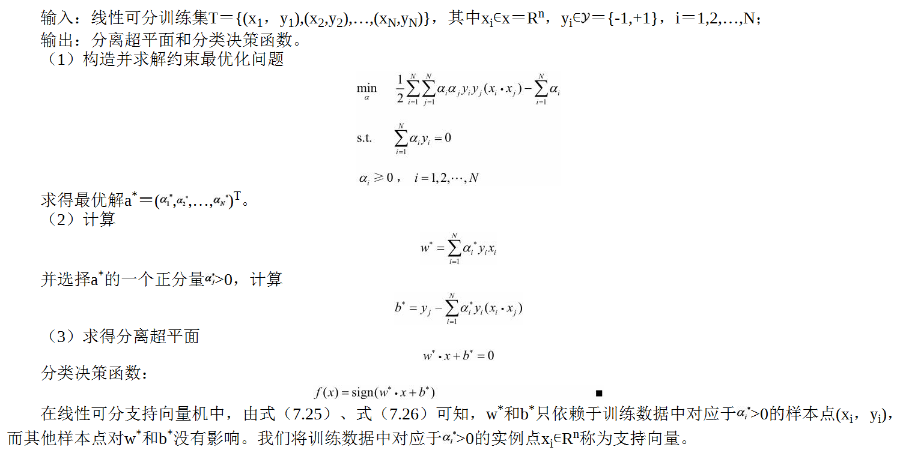
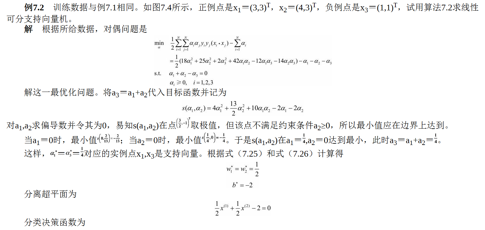

## 2. 线性支持向量机
线性可分问题的支持向量机学习方法，对线性不可分训练数据是不适用的，因为这时上述方法中的不等式约束并不能都成立。
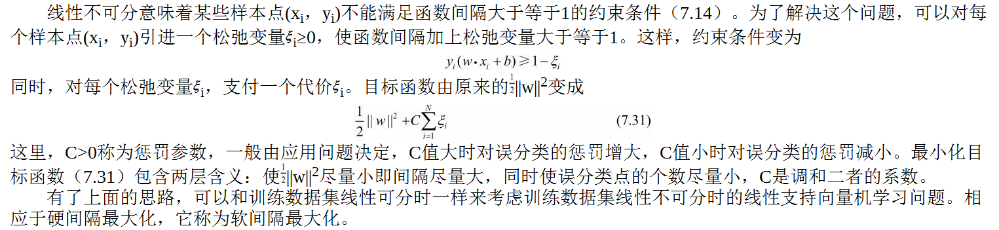
### 2.1 对偶算法

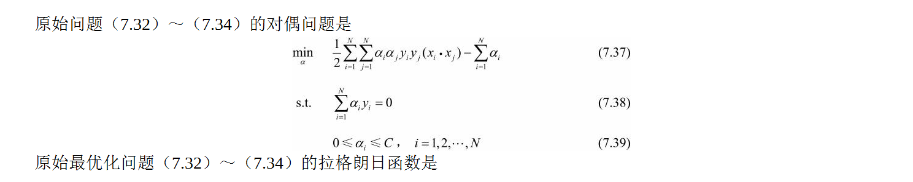
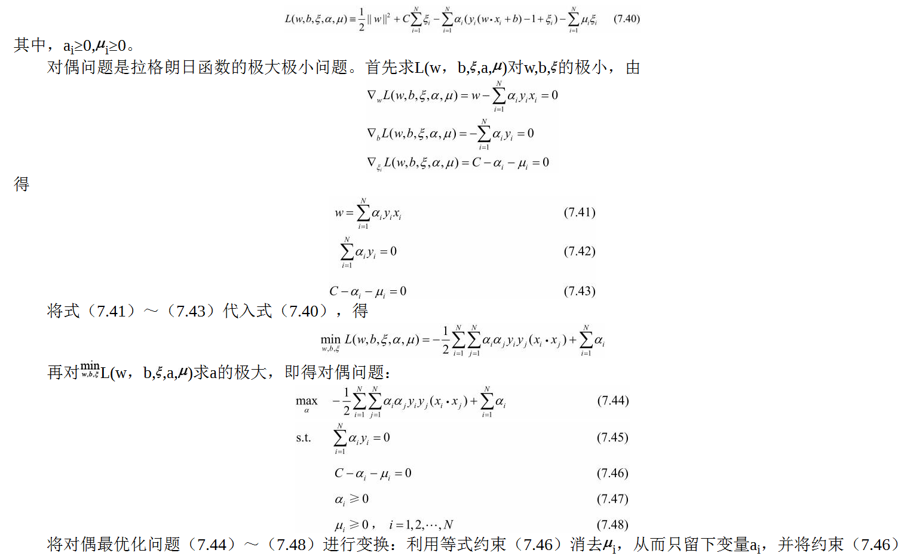
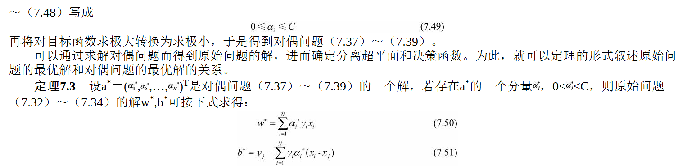
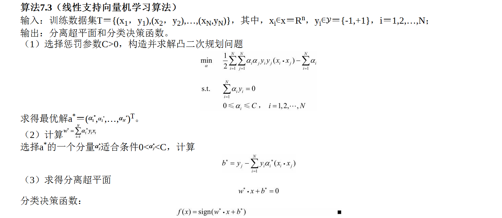

### 2.2 支持向量
软间隔的支持向量xi或者在间隔边界上，或者在间隔边界与分离超平面之间，或者在分离超平面误分一侧。
若α(i)<C，则ξ(i)＝0，支持向量xi恰好落在间隔边界上；
若α(i)＝C，0<ξ(i)<1，则分类正确，xi在间隔边界与分离超平面之间；
若α(i)＝C，ξ(i)＝1，则xi在分离超平面上；
若α(i)＝C，ξ(i)>1，则xi位于分离超平面误分一侧。

### 2.3 合页损失函数
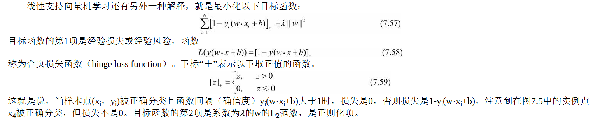
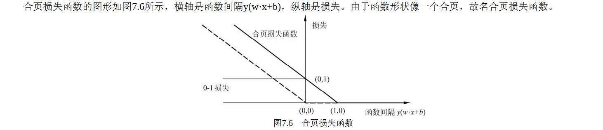
图7.6中虚线显示的是感知机的损失函数[yi(w·xi+b)]+。这时，当样本点(xi，yi)被正确分类时，损失是0，否则损失是-yi(w·xi+b)。
相比之下，合页损失函数不仅要分类正确，而且确信度足够高时损失才是0。也就是说，合页损失函数对学习有更高的要求。

## 3. 非线性支持向量机
非线性分类问题是指通过利用非线性模型才能很好地进行分类的问题。
一般来说，对给定的一个训练数据集，如果能用一个超曲面将正负例正确分开，则称这个问题为非线性可分问题。
非线性问题往往不好求解，所以希望能用解线性分类问题的方法解决这个问题。
所采取的方法是进行一个非线性变换，将非线性问题变换为线性问题，通过解变换后的线性问题的方法求解原来的非线性问题。

用线性分类方法求解非线性分类问题分为**两步**：
1. 使用一个变换将原空间的数据映射到新空间；
2. 然后在新空间里用线性分类学习方法从训练数据中学习分类模型。
核技巧就属于这样的方法。

核技巧应用到支持向量机，其基本想法就是通过一个非线性变换将输入空间（欧氏空间Rn或离散集合）对应于一个特征空间（希尔伯特空间），
使得在输入空间Rn中的超曲面模型对应于特征空间中的超平面模型（支持向量机）。
这样，分类问题的学习任务通过在特征空间中求解线性支持向量机就可以完成。

### 3.1 核函数
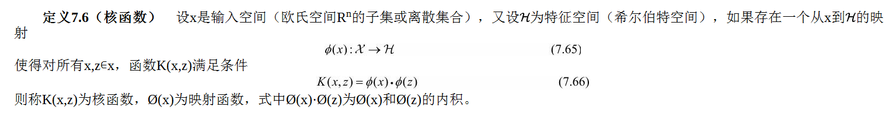
核技巧的想法是，在学习与预测中**只定义核函数**K(x,z)，而不显式地定义映射函数Ø。
通常，直接计算K(x,z)比较容易，而通过Ø(x)和Ø(z)计算K(x,z)并不容易。

### 3.2 核技巧
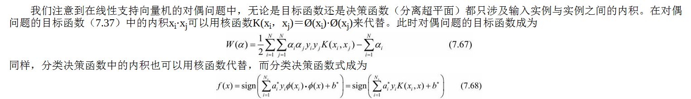

这等价于经过映射函数Ø将原来的输入空间变换到一个新的特征空间，将输入空间中的内积xi·xj变换为特征空间中的内积Ø(xi)·Ø(xj)，
**在新的特征空间里从训练样本中学习线性支持向量机**。
当映射函数是非线性函数时，学习到的含有核函数的支持向量机是非线性分类模型。

也就是说，在核函数K(x,z)给定的条件下，可以利用解线性分类问题的方法求解非线性分类问题的支持向量机。
**学习是隐式地在特征空间进行的，不需要显式地定义特征空间和映射函数**。
这样的技巧称为核技巧，它是巧妙地利用线性分类学习方法与核函数解决非线性问题的技术。
在实际应用中，**往往依赖领域知识直接选择核函数**，核函数选择的有效性需要通过实验验证。

### 3.3 正定核
已知映射函数Ø,可以通过Ø(x)和Ø(z)的内积求得核函数K(x,z)。**函数K(x,z)满足什么条件才能成为核函数**？

通常所说的核函数就是正定核函数（positive definite kernel function）。
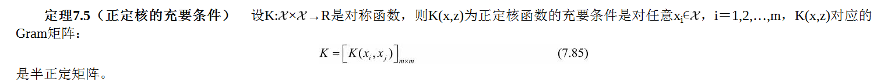

但对于一个具体函数K(x,z)来说，检验它是否为正定核函数并不容易，因为要求对任意有限输入集{x1，x2,…,xm}验证K对应的Gram矩阵是否为半正定的。
**在实际问题中往往应用已有的核函数**。

### 3.4 常用核函数
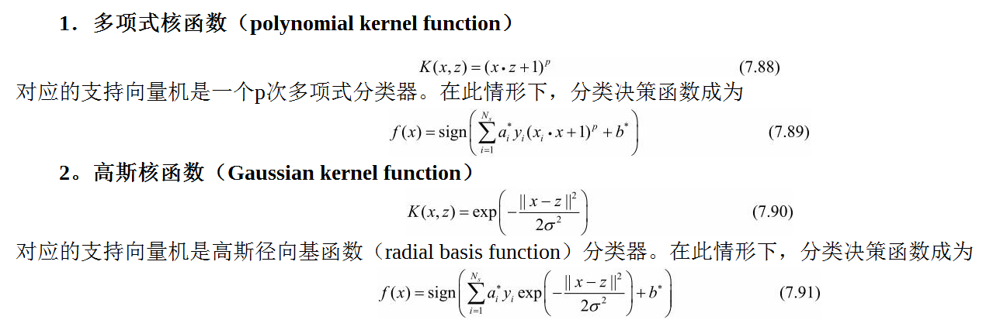

### 3.5 算法
将线性支持向量机扩展到非线性支持向量机，只需将线性支持向量机对偶形式中的**内积换成核函数**。
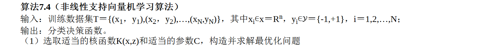
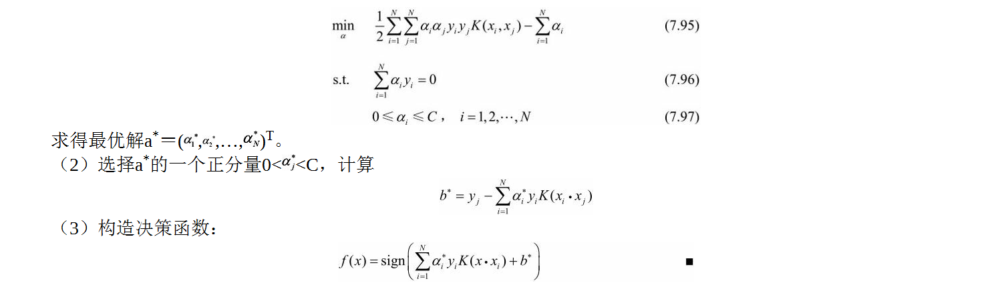

## 4. 序列最小最优化（sequential minimal optimization，SMO）算法
SMO算法是支持向量机学习的一种快速算法，其特点是不断地将原二次规划问题分解为只有两个变量的二次规划子问题，并对子问题进行解析求解，
直到所有变量满足KKT条件为止。这样通过启发式的方法得到原二次规划问题的最优解。
因为子问题有解析解，所以每次计算子问题都很快，虽然计算子问题次数很多，但在总体上还是高效的。

