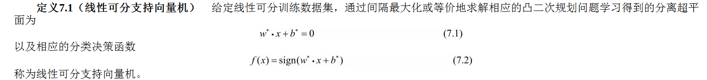

# 支持向量机

支持向量机（support vector machines，SVM）的基本模型是定义在特征空间上的间隔最大的线性分类器，**间隔最大使它有别于感知机**；
支持向量机还包括核技巧，这使它成为实质上的非线性分类器。
支持向量机的学习策略就是间隔最大化。

支持向量机学习方法包含构建由简至繁的模型：
当训练数据线性可分时，通过硬间隔最大化（hard margin maximization），学习一个线性的分类器，即**线性可分支持向量机**，又称为硬间隔支持向量机；
当训练数据近似线性可分时，通过软间隔最大化（soft margin maximization），也学习一个线性的分类器，即**线性支持向量机**，又称为软间隔支持向量机；
当训练数据线性不可分时，通过使用核技巧（kernel trick）及软间隔最大化，学习**非线性支持向量机**。

核函数（kernel function）表示将输入从输入空间映射到特征空间得到的**特征向量之间的内积**。
通过使用核函数可以学习非线性支持向量机，等价于隐式地**在高维的特征空间中学习线性支持向量机**。
这样的方法称为核技巧。

输入都由输入空间转换到特征空间，支持向量机的学习是在特征空间进行的。
线性可分支持向量机、线性支持向量机假设这**两个空间的元素一一对应**，并将输入空间中的输入映射为特征空间中的特征向量。
非线性支持向量机利用一个从输入空间到特征空间的**非线性映射**将输入映射为特征向量。

## 1. 线性可分支持向量机

学习的目标是在特征空间中找到一个**分离超平面**，能将实例分到不同的类。
分离超平面对应于方程w·x+b＝0，它由法向量w和截距b决定，可用(w,b)来表示。
分离超平面将特征空间划分为两部分，一部分是正类，一部分是负类。法向量指向的一侧为正类，另一侧为负类。
一般地，当训练数据集线性可分时，存在无穷个分离超平面可将两类数据正确分开。
**感知机**利用误分类最小的策略，求得分离超平面，不过这时的解有无穷多个。
线性可分支持向量机利用**间隔最大化**求最优分离超平面，这时，解是**唯一**的。

### 1.1 间隔
#### 函数间隔

一般来说，一个点距离分离超平面的远近可以表示分类预测的确信程度。
在超平面w·x+b＝0确定的情况下，|w·x+b|能够相对地表示点x距离超平面的远近。而w·x+b的符号与类标记y的符号是否一致能够表示分类是否正确。
所以可用量y(w·x+b)来表示分类的**正确性及确信度**，这就是函数间隔（functional margin）的概念。

如果成比例地改变w和b，例如将它们改为2w和2b，超平面并没有改变，但函数间隔却成为原来的2倍。
所以选择分离超平面时，只有函数间隔还不够。

我们对分离超平面的法向量w加某些约束，如规范化，||w||＝ 1，使得间隔是确定的。这时函数间隔成为几何间隔（geometric margin）。
其中，||w||为w的L2范数。

#### 几何间隔

如果超平面参数w和b成比例地改变（超平面没有改变），函数间隔也按此比例改变，而几何间隔不变。

### 1.2 间隔最大化
间隔最大化的直观解释是：对训练数据集找到几何间隔最大的超平面意味着以**充分大的确信度**对训练数据进行分类。
也就是说，不仅将正负实例点分开，而且对最难分的实例点（离超平面最近的点）也有足够大的确信度将它们分开。
这样的超平面应该对未知的新实例有很好的分类预测能力。

#### 如何求得一个几何间隔最大的分离超平面？

#### 支持向量

在决定分离超平面时**只有支持向量起作用**，而其他实例点并不起作用。
如果移动支持向量将改变所求的解；但是如果在间隔边界以外移动其他实例点，甚至去掉这些点，则解是不会改变的。
由于支持向量在确定分离超平面中起着决定性作用，所以将这种分类模型称为支持向量机。
支持向量的个数一般很少，所以支持向量机由很少的“重要的”训练样本确定。

#### 间隔边界
H1和H2平行，并且没有实例点落在它们中间。在H1与H2之间形成一条长带，**分离超平面与它们平行且位于它们中央**。
长带的宽度，即H1与H2之间的距离称为间隔（margin）。间隔依赖于分离超平面的法向量w，等于 2/||w||.H1和H2称为间隔边界。

### 1.3 对偶算法

#### 拉格朗日乘子法

